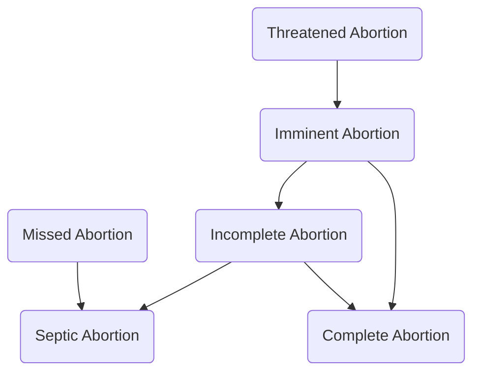

**References**:
 1. **Dr. RPS Maternal and Newborn Care: A Comprehensive Guide and Source Book for Teaching and Learning**, 2nd Edition, ISBN 978-971-98-2265-3, by Rosalinda Parado Salustiano (pp. 175-195)
 2. Lecturer (V)

An abortion is the termination of a pregnancy before the age of viability, currently at 20 weeks of gestation. Abortions are generally divided between those that are **induced**, and those that are **spontaneous**. Two types of induced abortions are the following:
1. **Therapeutic Abortion**: AKA Legal Abortion, to save the life of the mother. This may be used in cases such as ectopic pregnancies, and gravido cardia.
2. **Non-Therapeutic Abortion**: AKA Criminal Abortion, to get rid of unwanted pregnancies. These are commonly performed through "Hilot", midwives, doctors, then nurses. While the others perform that abortive procedure, nurses often suggest an abortive drug. Cytotec is a commonly used abortifacient. It is an antiulcer drug taken orally or used as a vaginal suppository.
	- When used as a vaginal suppository, cytotec changes the pH balance of the vagina, leading to ascending infection, resulting in chorioamnionitis. The amniotic fluid becomes infected, which the fetus also contracts. The uterus contracts, separating the placenta from the body to prevent infection, resulting in abortion.
	- When used orally (overdose amount), it induces uterine contractions. If underdosed, it may fail to abort the fetus but still result in congenital defects. This commonly results in anencephaly.

A **spontaneous abortion** occurs without medical or mechanical intervention. An abortion may present with signs of **vaginal bleeding or spotting**, **uterine/abdominal cramps**, **passage of tissues or products of conception**, and **signs related to blood loss/shock** (pallor, tachycardia, tachypnea, cool clammy skin, restlessness, oliguria, air hunger, and hypotension). There are six types:

1. **Threatened Abortion**: the only form of abortion where the pregnancy may still be saved. The only presenting signs in a threatened abortion are **contractions** or **abdominal cramping** and **spotting**.
2. **Imminent Abortion**: progression of threatened abortion to an unrecoverable state. This will result in a **complete or incomplete abortion**.
3. **Complete Abortion**: complete expulsion of all the products of conception. The abortion is done, and further care is focused on postpartum care.
4. **Incomplete Abortion**: a remnant of the products of conception is left in the uterus. This may progress to sepsis.
5. **Missed Abortion**: intrauterine fetal demise (IUFD); the fetus may remain in the uterus for **4 to 6 weeks** without leading into complications (sepsis). The mother often reports that there have been **no fetal movements**, prompting the nurse to auscultate and find **no fetal heart tone**. The best diagnostic examination is an **ultrasound**.
6. **Septic Abortion**: may result from incomplete or missed abortions. Discharge is foul and brown in color.

(According to Sir V.)

| Spontaneous Abortions | Bleeding/ Contractions | Cervical Dilatation                  |        B.O.W.        | Tissues Passed               | Fever |
| :----------------------- | ------------------------- | ------------------------------------ | :------------------: | ---------------------------- | :---: |
| **Threatened**           | Mild                      | Closed                               |         (+)          | None                         |  No   |
| **Inevitable**           | Moderate – Strong         | Open, especially inevitable if >3 cm |         (–)          | None                         |  No   |
| **Complete**             | Mild – None               | Close or partially open if recent    |         (–)          | Complete placenta with fetus |  No   |
| **Incomplete**           | Moderate – Strong         | Open                                 |         (–)          | Placenta/ Fragments       |  No   |
| **Missed**               | None                      | Closed before infection              | (+) before infection | None                         |  No   |
| **Septic**               | Moderate – Strong         | Open                                 |         (–)          | Either; foul discharge       |  Yes  |

| Spontaneous Abortions | Management                                                                                                                                                                                                                                                              | Medication                                                                        |
| ------------------------ | ----------------------------------------------------------------------------------------------------------------------------------------------------------------------------------------------------------------------------------------------------------------------- | --------------------------------------------------------------------------------- |
| **Threatened**           | - **No Internal Examinations** for any type of bleeding, as this causes further irritation and bleeding. - Sex is disallowed. - **External fetal monitoring** is done. - **Complete bed rest**. - Watchful waiting; **save pads** for monitoring discharge. | - **Tocolytic** - Sedatives, especially for an emotionally distressed patient. |
| **Inevitable**           | **Admission**/Hospitalization                                                                                                                                                                                                                                           |                                                                                   |
| **Complete**             | Pericare, etc.                                                                                                                                                                                                                                                          | Oxytocic Analgesics Antibiotics                                             |
| **Incomplete**           | **Dilatation and Curettage**                                                                                                                                                                                                                                            | Oxytocic Analgesics Antibiotics                                             |
| **Missed**               | **Delivery of abortus** **Dilatation and Curettage**                                                                                                                                                                                                                 | Oxytocic Analgesics Antibiotics                                             |
| **Septic**               | **Dilatation and Curettage**                                                                                                                                                                                                                                            | Oxytocic Analgesics Antibiotics Antipyretics Antiinflammatories       |
| **Habitual**             |                                                                                                                                                                                                                                                                         |                                                                                   |

(According to Dr. RPS)

| Spontaneous Abortions | Bleeding                      | Abdominal Cramps          | Cervical Dilatation                  | Tissue Passage                       | Fever |
| :----------------------- | ----------------------------- | ------------------------- | ------------------------------------ | ------------------------------------ | :---: |
| **Threatened**           | Slight                        | May or may not be present | None                                 | None                                 |  No   |
| **Inevitable**           | Moderate                      | Moderate                  | Open                                 | None                                 |  No   |
| **Complete**             | Small to negative             | Moderate                  | Close or partially open              | Complete placenta with fetus         |  No   |
| **Incomplete**           | Severe (bleeds the most)      | Severe                    | Open with tissue in cervix           | Fetal or incomplete placental tissue |  No   |
| **Missed**               | None to severe incoagulopathy | None; No FHT with UTZ     | None                                 | None                                 |  No   |
| **Septic**               | Mild to severe                | Severe                    | Close or open with or without tissue | Possible; foul discharge             |  Yes  |

>[!INFO] Habitual Abortion
>**Three or more consecutive abortions** can be considered **habitual** or **recurrent**. This is most commonly caused by an **incompetent cervix**, and occurs as any of the types of spontaneous abortions mentioned above. This is often detected in the threatened phase, and **cervical closure** (cerclage, cervical stitching) is done. If the cause of habitual abortion is not due to an incompetent cervix, determination of the etiology and treatment of the underlying cause is done.

Additional nursing care/management from Dr. RPS for Threatened and Inevitable Abortions

| Type                    | Nursing Care/Management                                                                                                                                                                                                                                                                                                                                                                                                                                                                                                                                                                             |
| ----------------------- | --------------------------------------------------------------------------------------------------------------------------------------------------------------------------------------------------------------------------------------------------------------------------------------------------------------------------------------------------------------------------------------------------------------------------------------------------------------------------------------------------------------------------------------------------------------------------------------------------- |
| **Threatened Abortion** | - Advise complete bedrest for 24 to 48 hours. - Teach to save all blood clots passed and perineal pads used. - Advise prompt reporting to the hospital if bleeding persists or increases. - Prevention of abortion: avoid coitus or orgasm, especially around the normal time of menstrual period.                                                                                                                                                                                                                                                                                         |
| **Inevitable Abortion** | - Save or monitor clots, pads, or tissues for a correct diagnosis. - Monitor VS, blood loss, I&O, changes in status, and signs of infection, and refer any deviation. - Institute measures to treat shock as necessary: replace blood, plasma, and fluids as ordered. - Prepare for surgery. - Provide psychological support: non-judgmental attitude, encourage verbalization, reduce anxiety, and allow the patient to cry. - Prevent isoimmunization: administer RhoGAM as ordered if: the mother is Rh negative; the abortus is Rh positive, and Coombs test result is negative. |
