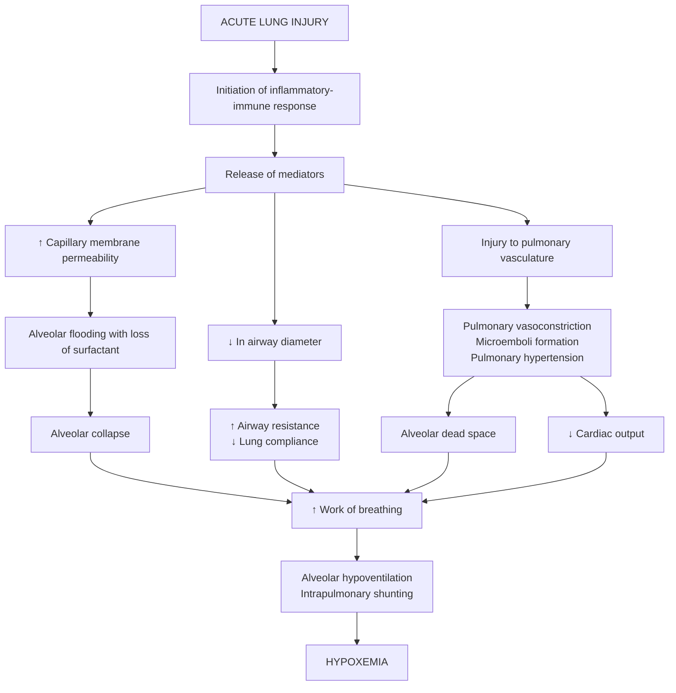

**References**:
1. **Brunner & Suddarth’s Textbook of Medical-Surgical Nursing**, 15th Edition, ISBN 978-197-51-6103-3, by Janice L. Hinkle, Kerry H. Cheever, and Kristen J. Overbaugh (Ch. 19, pp. \[ebook] 1639–1645)

___

**Acute respiratory distress syndrome** (ARDS) can be thought of as a spectrum of disease, progressing from mild to moderate to its most severe, fulminant form. **Acute lung injury** is a term commonly used to describe mild ARDS. It is a clinical syndrome characterized by a severe inflammatory process causing **diffuse alveolar damage** that results in sudden and progressive pulmonary edema, increasing bilateral infiltrates on chest x-ray, hypoxemia unresponsive to oxygen supplementation regardless of the amount of PEEP, and the absence of an elevated left atrial pressure.

Patients often demonstrate **reduced lung compliance**. A wide range of factors are associated with the development of ARDS, including **direct injury** to the lungs (e.g., smoke inhalation) or **indirect insult** to the lungs (e.g., shock). ARDS has been associated with a mortality rate ranging from 27% to 50%. Patients who survive the initial cause of ARDS may die later, commonly from **HCAP or sepsis**.

>[!WARNING] Risk Factors
>1. **Aspiration** (gastric secretions, drowning, hydrocarbons)
>2. **COVID-19 pneumonia**
>3. **Drug ingestion or overdose**
>4. **Fat or air embolism**
>5. **Hematologic disorders** (disseminated intravascular coagulation, massive transfusions, cardiopulmonary bypass)
>6. **Localized infection** (bacterial, fungal, viral pneumonia)
>7. **Major surgery**
>8. **Metabolic disorders** (pancreatitis, uremia)
>9. **Prolonged inhalation of high concentrations of oxygen, smoke, or corrosive substances**
>10. **Sepsis**
>11. **Shock** of any cause
>12. **Trauma** (pulmonary contusion, multiple fractures, head injury)
>
>Recently (2019), the new classification of **e-cigarette or vaping associated acute lung injury** (EVALI) was formulated by the CDC. It has been identified in most states in the U.S. Acute injury is caused by a reaction to aerosols and chemicals resulting in a robust inflammatory response resulting in ARDS.

___

# Pathophysiology
*Adapted from Brunner & Suddarth:*

1. **Inflammatory triggers** initiate the release of cellular and chemical mediators, causing injury to the alveolar capillary membrane in addition to other structural damage to the lungs. Severe ventilation-perfusion mismatching occurs.
2. **Alveoli collapse** because of the inflammatory infiltrate, blood, fluid, and surfactant dysfunction.
3. **Small airways are narrowed** because of interstitial fluid and bronchial obstruction.
4. **Lung compliance may markedly decreased**, resulting in decreased functional residual capacity and severe hypoxemia.
5. The blood returning to the lung for gas exchange is pumped through the nonventilated, nonfunctioning areas of the lung, causing *shunting*. This means that **blood is interfacing with nonfunctioning alveoli** and **gas exchange is markedly impaired**, resulting in **severe, refractory hypoxemia**.

___

# Clinical Manifestations
Initially, ARDS closely resembles **severe pulmonary edema**—the acute phase of ARDS is marked by a rapid onset of severe dyspnea that occurs less than 72 hours after the precipitating event. **Arterial hypoxemia that does not respond to supplemental oxygen** is characteristic. ARDS is classified according to the severity of hypoxemia characterized by the patient:
1. **Mild ARDS**: PaO₂/FiO₂[^1] >200 mm Hg but ≤300 mm Hg
2. **Moderate ARDS**: PaO₂/FiO₂ >100 mm Hg but ≤200 mm Hg
3. **Severe ARDS**: PaO₂/FiO₂ ≤100 mm Hg

Findings on **chest x-ray** are similar to those seen with cardiogenic pulmonary edema and are visible as **bilateral infiltrates** that quickly worsen. Mild ARDS progresses to **fibrosing alveolitis with persistent, severe hypoxemia**. The patient also has **increased alveolar dead space** (ventilation to alveoli but poor perfusion) and typically has **decreased pulmonary compliance** ("stiff lungs," which are difficult to ventilate). Clinically, the patient is thought to be in the recovery phase if the hypoxemia gradually resolves, the chest x-ray improves, and the lungs become more compliant.

___

# Assessment and Diagnostic Findings
1. **Intercostal retractions** and **crackles** may be present as the fluid begins to leak into the alveolar interstitial space.
2. Common diagnostic tests include **plasma brain natriuretic peptide** (BNP) levels, **echocardiography**, and **pulmonary artery catheterization**. The BNP level is helpful in distinguishing ARDS from cardiogenic pulmonary edema. Transthoracic echocardiography may be used if the BNP is not conclusive.

___

# Medical Management
The focus is identification and treatment of the underlying condition. Aggressive, **supportive care** must be provided to compensate for the severe respiratory dysfunction. This supportive therapy almost always includes **ET intubation and mechanical ventilation**.
1. **Circulatory support**, **adequate fluid volume**, and **nutritional support** are important.
2. **Supplemental oxygen** is used as the patient begins the initial spiral of hypoxemia. As the hypoxemia progresses, **intubation** and **mechanical ventilation** are instituted.
3. The concentration of oxygen and ventilator settings and modes are determined by the patient's status. This is monitored by **arterial blood gas analysis**, **pulse oximetry**, and **bedside pulmonary function testing**.
4. **Pharmacologic Therapy**: there is no specific pharmacologic treatment of ARDS except supportive care. **Neuromuscular blocking agents**, **sedatives**, and **analgesics** may be used to improve patient-ventilator synchronization and help to decrease severe hypoxemia.
5. **Nutritional Therapy**: **adequate nutritional support** is vital in the treatment of ARDS. Patients with ARDS require **35 to 45 kcal/kg/day** to meet caloric requirements.

>[!SUCCESS] Ventilatory PEEP Support
>Providing **ventilatory PEEP support** is a critical part of the treatment of ARDS. PEEP usually *improves oxygenation*, but it does not influence the natural history of the syndrome. The use of PEEP helps **increase functional residual capacity** and **reverse alveolar collapse** by keeping the alveoli open, resulting in improved arterial oxygenation and a reduction in the severity of the V/Q imbalance. By using PEEP, a lower FiO₂ may be required. The goal is a **PaO₂ greater than 60 mm Hg or an oxygen saturation level of greater than 90% at the lowest possible FiO₂**.
>
>**Systemic hypotension** may occur in ARDS as a result of hypovolemia secondary to leakage of fluid into the interstitial spaces and depressed cardiac output from high levels of PEEP therapy. Hypovolemia must be carefully treated without causing further overload. **Inotropic or vasopressor agents** may be required. Additional supportive treatments may include prone positioning, sedation, paralysis, and nutritional support.

___

# Nursing Management
## General Measures
**Close monitoring in the ICU** is generally required for patients with ARDS.
1. **Respiratory modalities**: oxygen administration, nebulizer therapy, CPT, ET intubation or tracheostomy, mechanical ventilation, suctioning, and bronchoscopy. Frequent assessment of the patient's status is necessary to evaluate the effectiveness of treatment.
2. **Positioning**: the nurse **turns the patient frequently** to improve ventilation and perfusion in the lungs and enhance secretion drainage. With each position, the nurse should observe for deterioration in oxygenation or improvement. For example, some patients improve in the prone position.
3. **Managing Anxiety**: the patient is extremely anxious and agitated because of the increasing hypoxemia and dyspnea. It is important to reduce the patient's anxiety because anxiety increases oxygen expenditure by preventing rest. **Rest is essential** to limit oxygen consumption and reduce oxygen needs.
## Ventilator Considerations
Several considerations must be addressed for the patient intubated and receiving mechanical ventilation with PEEP. PEEP, which causes increased end-expiratory pressure, is an unnatural pattern of breathing and feels strange to the patient. The patient may be anxious, and patient-ventilator dyssynchrony may be the consequence.
1. **Nursing assessment** is important to identify problems with ventilation that may be causing the anxiety reaction: **tube blockage by kinking or retained secretions**, **other acute respiratory problems** (e.g., pneumothorax and pain), a **sudden decrease in the oxygen level**, the **level of dyspnea**, or **ventilator malfunction**.
2. In some cases, **sedation** may be required to decrease the patient's oxygen consumption, allow the ventilator to provide full support of ventilation, and decrease the patient's anxiety. Sedatives that may be prescribed are lorazepam, midazolam, dexmedetomidine, propofol, and short-acting barbiturates.
3. If sedation is inadequate, **neuromuscular blocking** (paralytic) **agents**, e.g., pancuronium, vecuronium, atracurium, and rucoronium, may be given to paralyze the patient. This allows the patient to be ventilated more easily. The patient appears to lose consciousness and motor function and cannot breathe, talk, or blink independently. However, the patient **retains sensation and is awake and able to hear**. The nurse must reassure the patient that the paralysis is a result of the medication and is temporary. Talking to and not about the patient while in the patient's presence is important. Inform the family about this therapy to avoid unnecessary distress regarding the change in the patient's status. Paralysis is maintained for the shortest possible time and **never without adequate sedation and pain management**.

>[!WARNING] Nursing Care with Neuromuscular Blocking Agents
>Nursing assessment is essential to minimize the complications related to neuromuscular blockage. The patient may have **discomfort or pain but cannot communicate these sensations**. In addition, **frequent oral care and suctioning** may be needed.
>- While in use, **peripheral nerve stimulators** are used to assess nerve impulse transmissions at the neuromuscular junction of select skeletal muscles. A "train-of-four" test may be used to measure the level of neuromuscular blockage—four consecutive stimuli are delivered along a path of a nerve to evaluate whether or not stimuli are effectively blocked. Four equal muscle twitches indicates no muscular blockage. Weakened twitches indicate degrees of blockage. Absent twitching likely shows a 100% receptor blockage.
>- The use of neuromuscular blocking agents has many dangers and side effects. The nurse must **be sure that the patient does not become disconnected from the ventilator**, because respiratory muscles are paralyzed, making the patient unable to breathe independently. **All ventilator and patient alarms must be on at all times**. **Eye care** is also important because the patient is unable to blink, which may result in corneal abrasion.
>- Neuromuscular blockers also predispose the patient to **venous thromboembolism (VTE), muscle atrophy, foot drop, stress ulcers that may cause hemorrhage, and skin breakdown**.
>- **Analgesia** must be given concurrently with neuromuscular blocking agents—the nurse must anticipate the patient's needs regarding pain and comfort.
>- Ensure **positions** do not have **excessive pressure points and abnormal alignment**.

[^1]: **PaO₂** quantifies the amount of oxygen within the client's blood (Arterial oxygen tension). **FiO₂** quantifies the amount of oxygen the client breathes. As a ratio, this quantifies the difference between what the patient is breathing and how much of the oxygen the patient breathes in is transferred into the blood.
