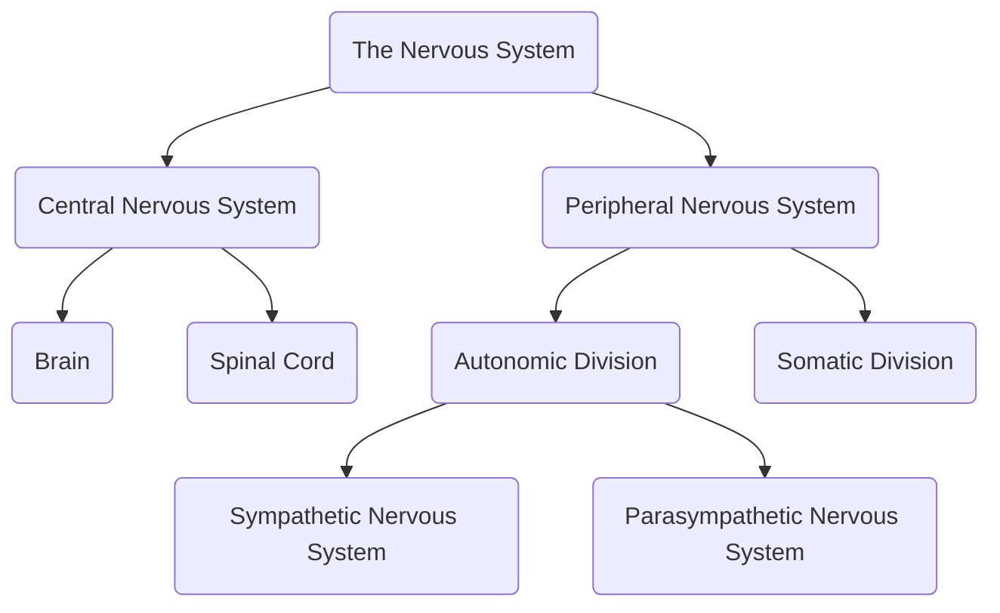

The nervous system is divided into two major parts, the **central nervous system** (brain and spinal cord) and **peripheral nervous system** (cranial nerves, spinal nerves, and autonomic nervous system). These systems exist to **control motor, sensory, autonomic, cognitive, and behavioral activities** with more than 100 billion cells just in the brain that link the motor and sensory pathways, monitor the body's processes, respond to the internal and external environment, maintain homeostasis, and conduct all psychological, biologic, and physical activity through complex chemical and electrical messages.

- The **Autonomic Division of the PNS** (involuntary) regulates the internal environment of the body and carries information from the CNS to the organs, blood vessels, and glands. It is divided between **sympathetic** (arouses the body; *fight or flight*) and **parasympathetic** (calms the body after arousal; *rest and digest*) subdivisions.
- The **Somatic Division of the PNS** is voluntary, mainly playing roles in skeletal muscles. It carries information to the CNS from the senses and from the CNS to the skeletal muscles.

___

# Cells of the Nervous System
The basic functional unit of the brain is the neuron, which is made up of dendrites, a cell body, and an axon.
- **Dendrites**: branch-type structures for receiving electrochemical messages.
- **Axon**: a long projection that carries electrical impulses away from the cell body.
- **Myelinated Sheath**: some neurons have a myelin sheath that increases the speed of conduction of a neuron.
- **Ganglia**/**Nuclei**: a cluster of nerve cell bodies. If the bodies serve the same function, it is a **center**, as in the "*respiratory center*", etc..
- **Neuroglial Cells** are cells supporting, protecting, and nourishing neurons at around 50 cells per 1 neuron in the brain.

___

# Brain Areas
1. **Frontal Lobe**: behavior, intelligence, memory, movement
2. **Temporal Lobe**: behavior, hearing, memory, speech, vision
3. **Parietal Lobe**: intelligence, language, reading, sensations
4. **Optical Lobe**: vision
5. **Cerebellum**: balance, coordination
6. **Brain Stem**: blood pressure, breathing, consciousness, swallowing, heartbeat
