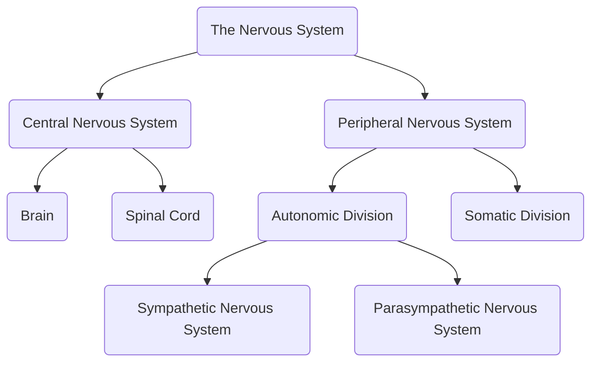

The nervous system is divided into two major parts, the **central nervous system** (brain and spinal cord) and **peripheral nervous system** (cranial nerves, spinal nerves, and autonomic nervous system). These systems exist to **control motor, sensory, autonomic, cognitive, and behavioral activities** with more than 100 billion cells just in the brain that link the motor and sensory pathways, monitor the body's processes, respond to the internal and external environment, maintain homeostasis, and conduct all psychological, biologic, and physical activity through complex chemical and electrical messages.

```mermaid
flowchart TD
1(The Nervous System)
1-->2.1
1-->2.2
2.1(Central Nervous System)
2.1-->2.1.1
2.1-->2.1.2
2.2(Peripheral Nervous System)
2.2-->2.2.1
2.2-->2.2.2
2.1.1(Brain)
2.1.2(Spinal Cord)
2.2.1(Autonomic Division)
2.2.1-->2.2.1.1
2.2.1-->2.2.1.2
2.2.2(Somatic Division)
2.2.1.1(Sympathetic Nervous System)
2.2.1.2(Parasympathetic Nervous System)
```

- The **Autonomic Division of the PNS** (involuntary) regulates the internal environment of the body and carries information from the CNS to the organs, blood vessels, and glands. It is divided between **sympathetic** (arouses the body; *fight or flight*) and **parasympathetic** (calms the body after arousal; *rest and digest*) subdivisions.
- The **Somatic Division of the PNS** is voluntary, mainly playing roles in skeletal muscles. It carries information to the CNS from the senses and from the CNS to the skeletal muscles.

# Peripheral Nervous System
The peripheral nervous system is composed of two groups of nerves: the **twelve cranial nerves** and the **thirty-one spinal nerves**.
1. **Cranial Nerves**
2. **Spinal Nerves**: 8 cervical nerves, 12 thoracic nerves, 5 lumbar nerves, 5 sacral nerves, and 1 coccygeal nerve.

___

# Cells of the Nervous System
The basic functional unit of the brain is the neuron, which is made up of dendrites, a cell body, and an axon.
- **Dendrites**: branch-type structures for receiving electrochemical messages.
- **Axon**: a long projection that carries electrical impulses away from the cell body.
- **Myelinated Sheath**: some neurons have a myelin sheath that increases the speed of conduction of a neuron.
- **Ganglia**/**Nuclei**: a cluster of nerve cell bodies. If the bodies serve the same function, it is a **center**, as in the "*respiratory center*", etc..
- **Neuroglial Cells** are cells supporting, protecting, and nourishing neurons at around 50 cells per 1 neuron in the brain.

___

# Brain Areas
1. **Frontal Lobe**: behavior, intelligence, memory, movement
2. **Temporal Lobe**: behavior, hearing, memory, speech, vision
3. **Parietal Lobe**: intelligence, language, reading, sensations
4. **Optical Lobe**: vision
5. **Cerebellum**: balance, coordination
6. **Brain Stem**: blood pressure, breathing, consciousness, swallowing, heartbeat

___

# Neuron
The neuron is the basic structural and functional unit of the nervous system, specialized for the transmission of electrical and chemical signals.

![[anaphy_neuron.png]]

*Taken from Principles of Anatomy and Physiology (14th Ed.) by Tortora.*

1. **Dendrite**
	- **Function:** Receives incoming signals from other neurons and transmits them toward the soma.
	- **Structure:** Branch-like extensions from the soma; often covered in synapses.
	- **Role:** Increases the surface area for communication with other neurons.
2. **Soma** (Cell Body)
	- **Function:** Integrates incoming signals from dendrites and generates outgoing signals to the axon.
	- **Structure:** Contains the nucleus and most organelles (e.g., mitochondria, ER).
	- **Role:** Metabolic center of the neuron; supports cell maintenance and neurotransmitter synthesis.
3. **Nucleus**
	- **Function:** Contains the neuron's DNA and regulates gene expression.
	- **Structure:** Membrane-bound organelle within the soma.
	- **Role:** Directs the production of proteins essential for neuronal function and repair.
4. **Axon**
	- **Function:** Conducts electrical impulses (action potentials) away from the soma to the axon terminal.
	- **Structure:** A long, thin projection that may be wrapped in myelin.
	- **Role:** Primary transmission line of the neuron.
	1. **Myelin Sheath**
		- **Function:** Insulates the axon to increase the speed of impulse conduction.
		- **Structure:** A layered, fatty covering around segments of the axon.
		- **Role:** Enables **saltatory conduction**, where impulses jump between nodes, speeding up transmission.
	2. **Schwann Cell**
		- **Function:** Produces the myelin sheath in the **peripheral nervous system (PNS)**.
		- **Structure:** Type of glial cell that wraps around a segment of the axon.
		- **Role:** Supports axon regeneration and insulation.
	3. **Myelin**
		- **Function:** Fatty substance making up the myelin sheath.
		- **Structure:** Composed of lipids and proteins.
		- **Role:** Prevents electrical signal loss and enhances conduction efficiency.
	4. **Node of Ranvier**
		- **Function:** Gaps between myelinated segments of the axon.
		- **Structure:** Exposed sections of axon between Schwann cells.
		- **Role:** Site of ion exchange; allows action potentials to "jump" from node to node (saltatory conduction).
5. **Axon Terminal** (Synaptic Terminal / Terminal Bouton)
	- **Function:** Releases neurotransmitters into the synaptic cleft to communicate with the next cell.
	- **Structure:** Bulb-like endings of the axon.
	- **Role:** Converts the electrical impulse into a chemical signal to stimulate adjacent neurons, muscle cells, or glands.
