A chronic, progressive, hereditary degenerative disease of the nervous system via unknown reasons resulting in **progressive involuntary choreiform movement** and dementia.
- Affects 1 in 10,000 individuals at midlife, equally between men, women, and races. **Onset** is often between 35 and 45 years of age, though 10% of cases are in children. Cases often **result in death within 10 to 20 years** from heart failure, pneumonia, infection, falls, or choking.
- All individuals have the gene for Huntington, but the disease requires inheritance of the expansion of the gene. **Huntington is transmitted through an autosomal dominant gene**, having a **50% risk of inheriting the disorder from a parent**.
- The genetic mutation in Huntington disease (*HTT*) has been identified and mapped. Genetic testing for its presence is possible, but it cannot predict the time of onset. Patients may also refrain from testing to avoid employment and healthcare discrimination due to their disease. **Genetic counseling** is crucial. Long-term psychological, emotional, financial, and legal support may be required.

```mermaid
flowchart LR
A(Abnormal proteins damage brain cells)
A-->1(Striatum Damage)-->1a(Impaired control of motor movements)
A-->2(Cortex Damage)-->2a(Altered cognition and behavior)
A-->3(Cerebellum Damage)-->3a(Uncoordinated voluntary muscle activity)
A-->4(↓ GABA, Acetylcholine)-->4a(Brisk, jerky, purposeless movements)
```

___

# Clinical Manifestations
**Triad signs**: **motor dysfunction, cognitive impairment, behavioral features**
1. **Motor Dysfunction**: **Chorea**/**Choreiform movements**, rapid, jerky, involuntary, and purposeless movements
	- As the disease progresses, the **writhing, twisting movements may involve the entire body**; all body musculature is involved. They have no purpose nor rhythm. Facial movements produce tics and grimaces.
	- **Speech becomes slurred**, hesitant, often explosive, and eventually unintelligible.
	- **Chewing** and **swallowing** is difficult. **Choking and aspiration are constant risks**.
	- **Disorganized gait** eventually makes ambulation impossible, making a wheelchair necessary. Even sitting may become impossible, and the patient becomes impaired in bed.
	- **Urinary and bowel control are lost**.
2. **Cognitive Impairment**: attention problems, emotion recognition are early forms of cognitive impairment. As the disease progresses, **marked dementia** becomes present.
3. **Behavioral Features**: apathy and blunted affect; the patient may become nervous, irritable, or impatient.
	- They are particularly subject to uncontrollable fits of **anger**, profound and often suicidal **depression**, apathy, **anxiety**, **psychosis**, or **euphoria** in the early stages of disease.
	- **Hallucinations, delusions, and paranoid thinking** may precede the appearance of disjointed movements.
	- Changes in emotional and cognitive symptoms become less acute in later stages of disease.

The disease progresses through three general stages: (1) **onset of neurologic or psychological signs and symptoms**, (2) increasing **dependence on others**, and (3) **loss of independent functions**. **Death** follows from complications such as **choking**, **falls**, **infection**, **pneumonia**, or **heart failure** generally 10 to 20 years after the onset of the disease.

Mnemonic:
1. **CHOREA**: Cognitive, Hallucinations and mood, Other movements, Rigidity and restlessness, Executive dysfunction, Attention problems

___

# Diagnostic Examination
Diagnosis is based on **characteristic symptoms** (motor dysfunction, cognitive impairment, and behavioral features), **positive family history**, and **presence of genetic marker CAG repeating on the Huntington (HTT) gene**.
- **CT or MRI imaging** is able to show **bilateral striatal atrophy** of the basal ganglia before motor symptoms appear.

___

# Medical Management
There is no treatment that stops or reverses the underlying process. The focus of treatment is on **optimizing quality of life** with available medication and supportive treatment. **Motor signs** must be assessed and evaluated on an on-going basis so that **optimal therapeutic drug levels** can be reached.
1. The only approved medication for **chorea** is **deutetrabenazine** or **tetrabenazine**, which deplete dopamine levels to reduce hyperkinesia.
	- **Benzodiazepines** and **neuroleptic** drugs have also been reported to control chorea. However, **akathisia** (motor restlessness) in the patient who is overmedicated is dangerous because it may be mistaken for the expected restless fidgeting of the illness and consequently may be overlooked.
2. **Antiparkinsonian Medications** In some types of the disease, **hypokinetic motor impairment** may resemble **PD**. In patients who present with **rigidity**, some temporary benefit may be obtained from **antiparkinsonian medications**.
3. **Psychiatric symptoms** can be controlled with **SSRIs** and **TCAs**.
	- **Suicide** is a risk, especially in the early stages of the disease.
	- **Antipsychotic medications** often work for **psychotic symptoms**.
	- **Anxiety** and **stress** may be reduced by **psychotherapy**.

___

# Nursing Care Management
1. **Risk for injury** from falls and possible skin breakdown (pressure injury abrasions), resulting from constant movement. Padding and skin care (emollients, lotion as needed) may be used.
2. **Impaired nutritional intake** due to inadequate ingestion and dehydration resulting from swallowing or chewing disorders and **danger of choking or aspirating food**. Relaxation techniques and medication may be used to facilitate adequate nutrition. Food provided should be easy to chew and bite-sized. Blenderized food may be used if the patient cannot chew. Choking precautions should always be in place.
3. **Impaired verbal communication** from excessive grimacing and unintelligible speech. Establish alternate methods of communication and determine the individual's expressions and their meanings. Consult with a speech therapist if beneficial.
4. **Acute confusion** and **impaired socialization**
	- Reorient the patient after awakening. Orienting devices in speech and the environment is also useful (calendars, clock, wall posters).
	- Maintain the patient's medical identification bracelet.
	- Keep the patient in the social mainstream.
