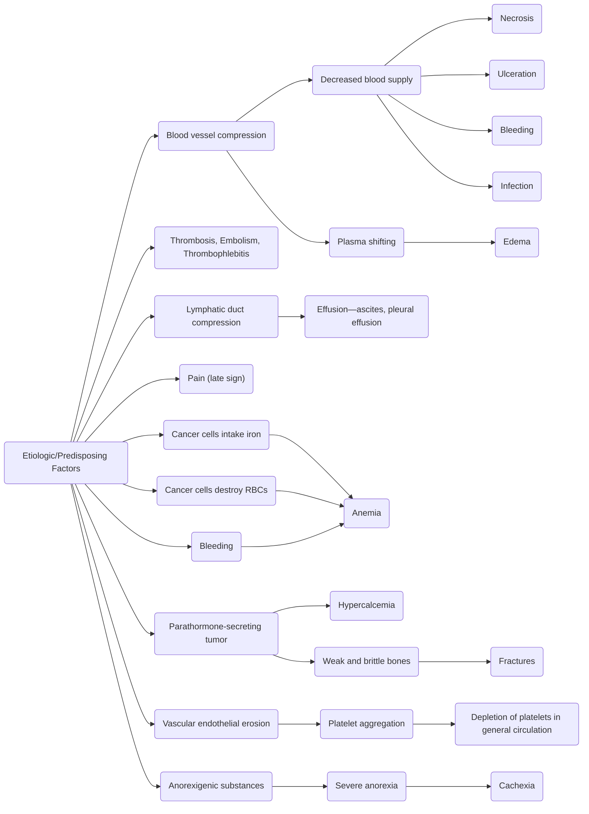

**References**:
1. **Comprehensive Nursing Licensure Review Book: Local and International Test Prep**, Volumes 1 and 2, ISBN 978-971-51-3383-8, by Josie Quiambao-Udan (Vol. 2, Ch. 2)
2. **The Topranker's Guide: A Comprehensive Study Guide for the Nurse Licensure Exam** (pp. 415–428)

>[!TIP] Compilation
>This is a **compilation** page. It's meant to cover a lot of topics in a short period of time. By nature, it's not as comprehensive as reading through these topics on their own pages one by one. It's focused on the important topics that usually appear in the board exam, but is still essentially complete.

___

Cancer (Greek "*karkinos*"—crab) is the appearance of cells that multiply without restraint, damage healthy tissue, and endanger life. The main cause of cancer is **unknown**—it is idiopathic in most cases.

There are two primary theories in the formation of cancer:
1. **Cellular Transformation (and Derangement) Theory**: cells exposed to etiologic factors transform into cancer cells.
2. **Failure of the Immune Response (IRS) Theory**: cancer cells are a natural occurrence during cell replication. All individuals have cancer cells in the body, which are then recognized and destroyed by a normally functioning immune response. With the failure of this response, the number of cancer cells begin to grow and eventually cause disease.

>[!ERROR] Etiologic Factors for Cancer
>1. **Viruses/Bacteria**: frequent viral infections can cause failure of the IRS that protects the body from cancer. These viruses are classified as "*oncogenic*" and exist in the environment.
>		- DNA viruses: Hepatitis B, Herpes, Epstein-Barr Virus
>		- Cytomegalovirus, Human papilloma virus
>		- RNA viruses: Human Immunodeficiency Virus, Human T cell lymphotropic virus type I
>		- Bacterium: *H. pylori*
>2. **Chemical Carcinogens**: cigarette smoking, alcohol, food preservatives, fertilizers, insecticides, vinyl chloride, and many others have been associated with cancer.
>3. **Physical Agents**: jagged teeth, ill-fitted dentures, and pipe smoking are some physical agents associated with cancer. Radiation, exposure to irritants, exposure to sunlight, and even altitude and humidity may be contributing factors.
>4. **Hormones**: estrogen preparations (diethylstilbestrol, estrogen) have been associated with cancer.
>5. **Genetics**: most cancers exhibit familial patterns. Common examples include colon cancer and premenopausal breast cancer.
>6. **Immune diseases**: AIDS and other immunosuppressive diseases disable the body's defenses against cancer cells.

>[!ERROR] Predisposing Factors for Cancer
>1. **Age**: older people are at higher risk for cancer.
>2. **Sex**: the most common type of cancer among females is breast cancer. The most common in men is prostate cancer. Men also have a higher cancer rate (~50% lifetime chance) than women (~33% lifetime chance).
>3. **Residence**: Rural vs Urban—there is a higher incidence rate of cancer in urban areas than in rural areas likely due to pollution, stress, and food preparation (more preservatives).
>4. **Geographic Distribution**: some cancers are more common among different demographics. For example, gastric cancer appears more frequently among Indo-Chinese people, potentially due to lifestyle (excessive intake of raw food, drinking large volumes of hot tea) and ethnicity.
>5. **Occupation**: chemical factor workers, mine workers, construction workers, those constantly exposed to the sun, and other occupations are related to higher rates of cancer.
>6. **Heredity**: certain types of cancer have been observed to affect different members of a family.
>7. **Stress**: stress may exhaust the immune response that protects the body from cancer.
>8. **Precancerous Lesions**: normally benign tumors, moles, warts, and keloids may be transformed into cancerous lesions. For example, Barrett's esophagus from gastroesophageal reflux disease (GERD) can become malignant (esophageal cancer; adenocarcinoma) due to cellular changes.
>9. **Obesity**: obesity has been linked to colon, esophageal, and breast cancer, among others.

| Characteristics          | Benign                                               | Malignant                                                                                                  |
| ------------------------ | ---------------------------------------------------- | ---------------------------------------------------------------------------------------------------------- |
| **Rate of Growth**       | Rapid                                                | Slow                                                                                                       |
| **Mode of Growth**       | Localized; clear borders                             | Infiltrates surrounding tissues; diffuse borders                                                           |
| **Capsule**              | Encapsulated (expands); movable                      | Non-encapsulated; fixed                                                                                    |
| **Cell Characteristics** | Well-differentiated mature cells with poor function  | Poorly differentiated embryonic cells                                                                      |
| **Recurrence**           | Unlikely                                             | Likely                                                                                                     |
| **Metastasis**           | Never                                                | Often                                                                                                      |
| **Neoplastic Effects**   | Localized effects, except when near vital organs     | Generalized effects—anemia, weakness, weight loss                                                          |
| **Prognosis**            | Very good—surgery is the primary method of treatment | May lead to death—treatment may be through surgery, irradiation, chemotherapy, and bone marrow transplants |

___

# Grading and Staging
**Metastasis** is the spread of cancerous cells from their origin to other tissues, organs, or systems of the body. There are stages of metastasis based on the degree of metastasis:
1. **Stage 0**: the cancer cells are isolated in the origin
2. **Stage 1**: spread into tissues surrounding the origin
3. **Stage 2**: spread of cancer through the lymphatic ducts and blood vessels
4. **Stage 3**: spread of cancer to secondary sites
	- Common sites for metastasis include the liver, lungs, bones, brain, and adrenal glands (*mn. LLBBA*)

**Tumor, Nodes, Metastasis (TNM) Staging**
1. **Tumor**: the size of the primary tumor
	- **TX**: Tumor cannot be assessed or measured; no information
	- **T0**: There is no evidence of a tumor
	- **TIS**: Carcinoma in situ (CIS) is an early form of cancer where abnormal cells are present but have not spread to surrounding tissues.
	- **T1**: The tumor is ≤2 cm
	- **T2**: The tumor is 3-5 cm
	- **T3**: The tumor is ≥6 cm
	- **T4**: The tumor has a direct extension to the chest wall and/or skin
2. **Nodes**: lymphatic involvement with cancer
	- **NX**: lymphatic involvement cannot be assessed
	- **N0**: there is no involvement of regional lymph nodes
	- **N1**: there are 1 to 3 regional lymph nodes involved
	- **N2**: there are 4 or more regional lymph nodes involved
	- **N3**: distant lymph nodes show signs of involvement
3. **Metastasis**: spread of cancer cells to distant tissues
	- **MX**: metastasis cannot be assessed
	- **M0**: no distant metastasis
	- **M1**: distant metastasis

**Residual Tumor Grading**: tumor status following treatment is described by the residual tumor. RX and R0 correspond to complete remission via resection. R1 and R2 involve cancer cells found at the primary tumor site (R1, R2) or regional lymph nodes (R2).
- **RX**: cannot be assessed
- **R0**: no residual tumor
- **R1**: microscopic residual tumor found at the primary tumor site
- **R2**: macroscopic residual tumor found at the primary cancer site or regional lymph nodes

___

# Warning Signs of Cancer
(*mn. CAUTION*)
1. **Change in Bowel or Bladder Habits**
2. **A sore that does not heal**
3. **Unusual bleeding or discharge**
4. **Unexplained sudden weight loss**
5. **Unexplained anemia**
6. **Thickening or Lump in the Breast or elsewhere**
7. **Indigestion or difficulty in swallowing**
8. **Obvious change in a wart or mole**
9. **Nagging cough or hoarseness**

Many types of cancer manifest similar systemic and generalized manifestations. These include **weight loss**, **frequent infection** (overwhelmed immune system), **skin problems**, **pain** (late sign), **hair loss**, **fatigue**, and **depression** (or disturbance in body image).

___

# Diagnostic Examinations for Cancer
1. **Biopsy**: the most accurate test for cancer is a direct examination of cancerous cells. It may be done via needle aspiration, incision, or excision. Staging may require multiple needle or incisional biopsies.
2. **Tumor Marker Identification**: analysis for substances found in the body that are created by a tumor, e.g. Prostate-specific Antigen (PSA) or Prostatic Acid Phosphatase in benign prostatic hyperplasia.
3. **Imaging**:
	- **Mammography** is the best way to find breast cancer early, especially for postmenopausal and women who have undergone a hysterectomy. It is recommended as an annual procedure for women 45 to 54 years old, and every other year for those 55 and older.
	- **Magnetic resonance imaging** (MRIs) for neurologic, pelvic, abdominal, thoracic, and breast cancer
	- **Fluoroscopy** for skeletal, lung, and gastrointestinal cancers
	- **Positron emission tomography** (PET) for lung, colon, liver, pancreatic, and lymphomas
	- **Endoscopy** for bronchial and gastrointestinal cancers
	- **Sigmoidoscopy** by 50 years old, done every three to five years
4. **Self-Examination** for Breast and Testicular Cancer via palpation and visualization.
	- **Breast Self-Examination** is recommended for women aged 20 and above, done after the last day (or 7 days after onset) of menstruation.
	- **Testicular Self-Examination** is recommended for men aged 13 and above, done monthly on the same day. It is best done after a warm shower (when the scrotal rugae are relaxed). The testes should feed like a firm (but not hard) egg that is smooth with no lumps. Findings of unequal testicular size or position are usually normal.
5. **Papanicolaou Test** (Pap smear test) is a screening test for precancerous changes of cervical cells. This also works in conjunction with an HPV test, which is a known virus that can lead to cervical cancer.
	- This is done every three years for women aged 21 to 65. For women aged 30 to 65, an additional test, HPV testing, is done every five years. Either of the two (Pap, HPV) may be done for 30 to 65 year old women.

___

# Preventive Measures for Cancer

| System       | Measures                                                                                                                                                                                                                                             |
| ------------ | ---------------------------------------------------------------------------------------------------------------------------------------------------------------------------------------------------------------------------------------------------- |
| **Skin**     | Avoid overexposure to sunlight, artificial sources of UV light, ionizing radiation, x-rays, and radioisotopes Avoid environmental and occupational carcinogens (arsenicals, pesticides, coal tar products)                                        |
| **Oral**     | Oral and dental exam twice a year                                                                                                                                                                                                                    |
| **Breast**   | Monthly BSE from age 20 years, and annual mammogram from age 45 onwards                                                                                                                                                                              |
| **Lungs**    | Smoking cessation; avoiding second-hand smoke Avoid environmental and occupational carcinogens (wear PPE) e.g. asbestos, hydrocarbons, radon gas Annual chest x-ray                                                                            |
| **Prostate** | Avoid high-fat foods, limit alcohol, avoid occupational carcinogens (Cd, rubber, fertilizers)                                                                                                                                                        |
| **Colon**    | Annual digital rectal exam from age 40 years onwards Annual guaiac stool exam from age 50 onwards Proctosigmoidoscopy exam from age 50 every 3 to 5 years after negative results for 2 consecutive years                                       |
| **Uterus**   | Annual Papanicolaou exam for all sexually active or previously sexually active women. Otherwise, the Pap exam is done every 3 years from age 21 onwards (read above).                                                                                |
| **General**  | Annual blood works and physical exam Diet: avoid obesity, cut down on total fat intake, increase fiber intake, include vitamin A, vitamin C, and cruciferous vegetables. Moderate alcoholic beverages and salty, smoked, and nitrite-cooked foods |

___

# Therapeutic Modalities for Cancer
## Surgical Interventions
**Surgical Interventions** are a first-line management to cancer. It involves destruction, partial removal, or complete removal of cancerous cells. This may be done with local excisions, radical excisions (involvement of adjacent lymph nodes and surrounding tissues), and other methods such as electrosurgery, cryosurgery, and chemosurgery.

Nursing management pre-procedure focuses on health education about the surgery and to provide emotional support (standard). Post-procedure, monitoring is crucial—infection, bleeding, thrombophlebitis, wound dehiscence, fluid and electrolyte imbalances, and organ dysfunction are possible complications.
## Chemotherapy
**Chemotherapy** is a method of treatment that involves destruction of rapidly dividing cells, though often affecting both normal and abnormal cells. This may be used as a primary method of treatment, as **neoadjuvant therapy** (make tumor smaller before surgery or radiation therapy), or as **adjuvant therapy** (destroy remaining cancer cells that remain after surgery or radiation therapy).

Administration of chemotherapy is most commonly intravenous, but can also be oral (most convenient), intramuscular, intrathecal, intraarterial, intracavitary, intravesical, or topical. In any form, however, chemotherapeutic drugs are dangerous. Contact with the medication can cause injury.

Because of the nature of chemotherapy, it is contraindicated in patients who have an active infection, who have undergone recent surgery or radiation therapy, who have impaired renal or hepatic function, who are pregnant, and whose bone marrow is depressed (below normal white blood cell count).

>[!TIP] Handling Chemotherapeutic Agents
>Chemotherapeutic agents are dangerous—proper handling is very important to avoid harm to the nurse preparing medications. Normally, handling chemotherapeutic drugs is reserved for trained personnel ("*Chemotherapy Certified Nurses*"). Pregnant nurses should not handle chemotherapeutic drugs. Preparation should be done in a well-ventilated area.
>1. Wear personal protective equipment: mask, gloves, and a back-closing gown.
>2. Clearly label any IV bottles with chemotherapy agents as "ANTINEOPLASTIC CHEMOTHERAPY".
>3. Any contact with the drug must be washed/flushed immediately.
>4. Wipe the external surface of syringes and IV bottles. Sterile or alcohol-wet cotton pledgets should be wrapped around the neck of the vial or ampule.
>5. Instilled air should be vented to reduce internal pressure within vials.
>6. When expelling air from a syringe, the end of the needle is pointed into a cotton ball to absorb any droplets or leakage. In case of spillage, a spill kit may be used for clean up.
>7. Contaminated needles and syringes are disposed in a leak-proof, puncture-proof container. Half-empty ampules, vials, or IV bottles are placed into a plastic bag and disposed of as hazardous waste.
>8. Handwashing is done before and after the removal of gloves.
>9. Administration is preferred through central lines. Veins should be warmed up to dilate them, reducing the degree of irritation by the drug.

### Antineoplastic Agents

>[!TIP] Cell Cycles
>Replicating cells undergo various phases:
>- G₁ Phase: RNA and protein synthesis
>- S Phase: DNA synthesis
>- G₂ Phase: Pre-mitotic phase
>- M phase: Mitosis
>- Go phase: Resting/dormant phase
>
>Drugs may act to disrupt specific phases of this cycle (cell-cycle-specific drugs) or act regardless of this cycle (non-cell-cycle-specific drugs). Cell-cycle-specific drugs include antimetabolites, topoisomerase inhibitors, and mitotic inhibitors. Non-cell-cycle-specific drugs include alkylating agents, antibiotics, nitrosoureas, hormonal agents, and monoclonal antibodies.

1. **Alkylating Agents**: non-specific; drugs that break the DNA helix thereby interfering with DNA replication.
	- Busulfan (Myleran), Carboplatin, Cyclophosphamide (Cytoxan, Neosar), Ifosfamide (Ifex, Holoxan), Cisplatin (Platinol AQ), Thiotepa, Procarbazine (Matulane), Chlorambucil (Leukeran), Mechlorethamine (Mustargen), *Nitrogen Mustards*
2. **Nitrosoureas**: similar to alkylating agents, and crosses the blood-brain barrier.
	- Carmustine, Lomustine, Semustine, Streptozocin
3. **Mitotic Inhibitors**: cell-cycle specific; blocks M phase of the cell cycle*.
	- Etoposide \[VP-161] (VePesid), Vinblastine (Velban, Velbe), Vincristine (Oncovin, Vincasar PFS)
4. **Antitumor Antibiotics**: non-specific; interference of DNA synthesis and prevention of RNA synthesis. These usually end in "-*cin*".
	- Bleomycin (Blenoxane), Dactinomycin, Daunorubicin, Doxorubicin (Adriamycin, Rubex), Plicamycin (Mitracin)
5. **Antimetabolites**: specific; disrupts DNA replication in the S phase.
	- Cytarabine \[ARA-C] (Cytosar-U), Fludarabine (Fludara), Fluorouracil \[5-FUJ] (Adrucil), Methotrexate (Folex, Rheumatrex)
6. **Hormones**: non-specific; binds to hormone receptor sites that alter cellular growth or blocks binding of estrogens to receptor cites. These include androgens, estrogens, and anti-androgens and anti-estrogens.
	- Anastrozole, Flutamide, Goserelin, Megestrol Acetate (Megace), Tamoxifen Acetate (Nolvadex), Triptoerlin (Trelstar Depot, Trelstar LA)
7. **Monoclonal Antibodies** are non-specific and can target cancer cells while sparing normal cells.
	- Rituximab, Trastuzumab, Alemtuzumab, Gemtuzumab
8. **Miscellaneous Antineoplastic Agents**
	- Interleukin-2, IL-2 (Proleukin) is an immunoregulator used for skin and kidney cancer. It is cardiotoxic and pneumotoxic. Allergic or anaphylactic reactions may occur.
	- Aminoglutethimide (Cytadren)
	- L-Asparaginase (Elspar, Oncaspar)
### Side Effects of Chemotherapy

| Side Effect                      | Nursing Management                                                                                                                                                                                                                                                                                                                                                                                                                                                                                                                                                                 |
| -------------------------------- | ---------------------------------------------------------------------------------------------------------------------------------------------------------------------------------------------------------------------------------------------------------------------------------------------------------------------------------------------------------------------------------------------------------------------------------------------------------------------------------------------------------------------------------------------------------------------------------- |
| **Nausea and vomiting**          | Antiemetic (e.g., Zofran/Ondansetron). This may be delayed, appearing one week after chemotherapy. If vomiting occurs, provide good oral hygiene, monitor for dehydration, and offer ice chips (dry mouth, hydration).                                                                                                                                                                                                                                                                                                                                                             |
| **Stomatitis** **Xerostomia** | Provide good oral care; warm saline rinse (never alcohol-based) done frequently. Inspect the mouth routinely. The patient is placed on a soft, bland diet with no spicy or citrus (acidic) food. Ice chips or popsicles are provided for xerostomia. A soft toothbrush is used to reduce mucosal damage. In case pain is a problem, viscous lidocaine may be applied for adults. This is not used for children due to its ability to suppress the gag reflex.                                                                                                             |
| **Anorexia**                     | The loss of appetite is a result of many factors of cancer—nausea and vomiting, stomatitis, xerostomia, and a common alteration in the ability to taste. Food, especially meat, tastes metallic to patients. When feeding, food should be served attractively. The patient should be placed in a comfortable position and provided general comfort to facilitate their appetite.                                                                                                                                                                                                   |
| **Alopecia**                     | The patient can wear wigs, caps, a head scarf, or hats. A pre-emptive hair cut can help reduce negative feelings from hair loss. Inform the patient of alopecia that normally occurs 2 to 3 weeks after chemotherapy, and reassure the patient that the hair will grow back, albeit potentially with a different texture or color.                                                                                                                                                                                                                                              |
| **Anemia**                       | Frequent rest periods, oxygen therapy as needed, and blood transfusion as needed. Assess for skin pallor. Erythropoietin may be ordered by the physician.                                                                                                                                                                                                                                                                                                                                                                                                                          |
| **Neutropenia**                  | Infection precautions—reverse isolation, asepsis, avoidance of fresh fruits/raw foods/foods that have been refrigerated for days, and limiting visitors (especially those with infections). The patient should be educated on the signs of infection: fever, abnormal lung sounds, coughing.                                                                                                                                                                                                                                                                                       |
| **Thrombocytopenia**             | Bleeding/injury precautions, e.g., soft-bristled toothbrush (no flossing), use of electric razors (not straight razors), and avoid aspirin/ASA/NSAIDs. Avoid straining as it may cause rectal bleeding. Stool softeners are used while suppositories and enemas are avoided, as these also pose the risk of rectal bleeding. Minimize procedures that cause bleeding; if injections are done, apply pressure to the area for at least five minutes. Encourage the use of water-based lubricant before sexual activity. Platelet transfusions may be done if necessary. |
| **Hemorrhagic Cystitis**         | Chemotherapeutic metabolites that are eliminated via urine (often from cyclophosphamide \[Cytoxan]) can damage the bladder. This is characterized by dysuria and hematuria. Increase fluid intake (~2,500 mL/day) to dilute metabolite concentration in the urine.                                                                                                                                                                                                                                                                                                                 |

The side effects of chemotherapeutic management is intensive, but intermittent with the use of chemotherapy. The PAINFUL or CHEMOTHERAPY mnemonic can be used to remember the most pertinent considerations for chemotherapy:
1. **Pancytopenia**
2. **Anaphylaxis**
3. **Immunosuppression**, **Infertility**
4. **Nephrotoxicity**, ototoxicity, hepatotoxicity; Nausea and vomiting
5. **Fetotoxicity**, cytotoxicity
6. **Ulceration**/stomatitis; **Uric acid elevation**
7. **Loss of hair**—alopecia
8. **Check for phlebitis and extravasation**
9. **High calorie and high protein diet**
10. **Encourage hydration**
11. **Monitor CBCs** for pancytopenia, anemia, neutropenia, or thrombocytopenia
12. **Oral examination** for stomatitis
13. **Teratogenic**
14. **Hair loss**
15. **Encourage counseling**
16. **Report complications**
17. **Administer antiemetics**
18. **Practice aseptic technique**
19. **You should wear a pair of gloves, a gown, and a mask when handling chemotherapeutic drugs**
### Drug-Specific Precautions

| Chemotherapeutic Drug                                                                    | Effect                 | Precautions                                                   |
| ---------------------------------------------------------------------------------------- | ---------------------- | ------------------------------------------------------------- |
| **Plicamycin** (Methracin)                                                               | Bleeding               | Avoid anticoagulants                                          |
| **Daunorubicin** **Doxorubicin**                                                      | Cardiotoxic            | ECG monitoring                                                |
| **Bleomycin**                                                                            | Pulmonary toxicity     | Pulmonary function tests                                      |
| **5-Fluorouracil**                                                                       | Cerebellar dysfunction | Assess for ataxia                                             |
| **Methotrexate**                                                                         | Bleeding               | Assess for bleeding. Apply an antidote (Leucovorin) if toxic. |
| **Cisplatin**, **Carboplatin**                                                           | Nephrotoxic            | Monitor I&O and urine                                         |
| **Cyclophosphamide**                                                                     | Hemorrhagic cystitis   | Observe for hematuria and dysuria.                            |
| **Busulfan** (Myleran) **Chlorambucil** (Leukeran) **Mechlorethamine** (Mustargen) | Hyperuricemia          | Increase fluid intake to prevent urinary stone formation.     |
| **Vincristine**                                                                          | Peripheral neuropathy  |                                                               |
| **Decadron**                                                                             | Puffy face             |                                                               |

## Radiation Therapy
**Radiation Therapy** utilizes ionizing radiation to interrupt cancerous cell growth. This may be applied from outside the body (external—teletherapy) or from inside the body (internal—brachytherapy).
1. **Teletherapy** uses x-rays to destroy cancer cells superficially or deeper in the body. The radiation source is far from the client.
	- The nurse takes measures to ensure proper shielding, timing, and distance of all individuals involved in the procedure. The patient should be informed of the nature of the procedure; the procedure is painless and lasts for only a few minutes at a time. The patient will have to remain very still on a special table in specified positions to maximize tumor irradiation. To allay anxiety, inform the patient that the machine is expected to move or make noise, and that the patient will remain alone in the room during irradiation to prevent exposure to staff or family members.
	- Nursing interventions are focused on the effects of radiotherapy on the skin (risk for impaired skin integrity), commonly manifesting as **radiodermatitis**. The patient is instructed to **avoid using ointments, lotions, powders, or other cosmetics on the area being irradiated**. Exposure of the area to **direct sunlight** should also be avoided. The markings on the area should be kept in place and not erased. Cleaning should only be done with warm water and mild soap, without rubbing. Restrictive clothing should not be applied over the area. These changes also affect the oral mucosa, so gentle oral hygiene should be given.
	- Compared to brachytherapy, the patient is not a radioactive risk due to an implant. The patient does not require isolation as there is no residual radioactivity.

>[!ERROR] Other Adverse Reactions to Teletherapy
>1. **Skin reactions**: erythema (redness), itchiness, dryness, moistness, and desquamation may occur in radiodermatitis. In severe cases, blistering and ulceration may appear. Keep the area dry; rinse with water and no/mild soap then pat dry (do not rub). Do not use/expose the area to ointments, powders, lotions, heat, cold, direct sunlight, and constrictive/irritating clothing.
>2. **Infection**: bone marrow suppression due to radiation warrants monitoring of blood counts weekly, good personal hygiene, and educating the patient on signs of infection
>3. **Hemorrhage**: platelets are vulnerable to radiation. Platelet count is also monitored during radiation therapy. Avoid physical trauma and the use of aspirin (blood thinner). Stool and skin should be observed for signs of hemorrhage. When parenteral routes are used, apply direct pressure until bleeding stops.
>4. **Fatigue**: high metabolic demands from exposure to radiation requires plenty of rest and good nutrition.
>5. **Weight loss** can occur from anorexia due to pain and the effect of cancer (anorexigenic substances). Megestrol Acetate (Megace) has been used as an appetite stimulant to counteract cancer-related anorexia and cachexia.
>6. **Stomatitis**: ulceration of oral mucous membranes are common as an effect of radiation. The nurse should apply analgesia before meals to facilitate nutrition, use a bland diet and avoid alcohol and smoking to prevent irritation, and provide good oral hygiene or saline rinses every two hours. Sugarless lemon drops may also be given to promote salivation; saliva helps act as a protective barrier for the oral mucosa.
>7. **Diarrhea**
>8. **Nausea and Vomiting**
>9. **Headache**
>10. **Hair loss**/**Alopecia**
>11. **Cystitis**
>12. **Social Isolation**
>13. **Xerostomia**: managed with artificial saliva.

2. **Brachytherapy** is a method of delivering radiation from within the body through sealed or unsealed methods. With this type of radiation therapy, the patient requires isolation due to emitted radiation. Their eating utensils must be disposable and visitors are limited. Linens and dressings used by the patient are also considered a hazard and must be kept until the implant has been removed.
	- **Sealed Source Brachytherapy** uses beads, seeds, needles, ribbons, or catheters that contain radioactive material that is implanted in the cancerous tissue or within hollow organs (intracavitary). This radiates the tissues, but **bodily secretions do not become radioactive**. This is used for radioisotopes that have long half-lives. The patient should remain on complete bed rest and on a low-residue/low-fiber diet to slow down bowel movement and prevent defecation. An indwelling urinary catheter is also inserted. These measures (CBR, diet, catheterization) all aim to reduce the incidence of **implant displacement**.
		- For those with cervical/vaginal implants, sexual intercourse may be resumed after 7 to 10 days. For women, a povidone iodine douche is recommended. Use condoms.
	- **Unsealed Source Brachytherapy** uses orally or intravenously delivered substances to deliver radiation. This is used for radioisotopes that have short half-lives (e.g., I131 for thyroid cancer). Compared to sealed source brachytherapy, with this method **bodily secretions become radioactive** within 48 hours.
		- The patient is instructed to flush the toilet three to four times after use, and to rinse the sink well after toothbrushing. Visitors should not use these utilities.
	- Assignment to patients undergoing brachytherapy should be limited to 30 minutes, to one irradiated patient per nurse per shift, and with a lead apron and dosimeter badge to limit radiation exposure. Pregnant nurses should not be assigned to these patients.
	- **Visitation is also prohibited for pregnant visitors, those 16 years old or younger, and those who are immunocompromised or with an active infection**. Distance should be kept to at least 6 feet from the patient.

>[!ERROR] Dislodged Implants
>Implants that become dislodged are radioactive hazards. Management involves the use of long-handled forceps and a lead container. If a dislodged implant cannot be found, the M.D. is notified. Documentation is done accordingly.

## Bone Marrow Transplantation
Bone marrow transplants are used for bone marrow cancers (e.g., leukemia) with healthy bone marrow from other sources. This may be **allogenic** (from another person, the standard therapy), **syngeneic** (from an identical twin), or **autogenic** (from other parts of their own body, the most common form).

>[!WARNING] Complications of Bone Marrow Transplantation
>1. **Veno-occulsive Disease**
>2. **Failure of engraftment**
>3. **Infection**, most likely in the first three to four weeks
>4. **Pneumonia**
>5. **Graft vs. Host Disease** (GVHD), an immunologic reaction of engrafted lymphoid cells against the tissues of the recipient. This may be acute (within 100 days post-transplant) or chronic (100 to 400 days post-transplant)

___

# General Management
The ultimate goal of cancer therapy is to cure the client and to allow for a normal life expectancy, but this is not always possible. Some types of cancer and some degrees of severity of cancer are simply not curable. Some may be controlled over long periods of time but this poses a threat to the quality of life and expected life expectancy of the individual. In many cases, patients are terminally ill as cancer is no longer curable nor controllable. In such patients, the nurse's main priority is **palliative care**—maintenance of quality of life.

| Objective                         | Interventions                                                                                                                                                                                                                                                                                                                                                                                                                                                                                 |
| --------------------------------- | --------------------------------------------------------------------------------------------------------------------------------------------------------------------------------------------------------------------------------------------------------------------------------------------------------------------------------------------------------------------------------------------------------------------------------------------------------------------------------------------- |
| Maintain tissue integrity         | Handle skin gently; do not rub affected areas. Lotions may be applied but the skin should only be washed with mild soap and water.                                                                                                                                                                                                                                                                                                                                                            |
| Management of stomatitis          | Soft-bristled toothbrush, saline oral rinses (no alcohol-based rinses)                                                                                                                                                                                                                                                                                                                                                                                                                        |
| Management of alopecia            | Education: begins in two weeks, regrowth within eight weeks after termination (with potential change in texture and color). Pre-emptive hair cuts and wig selection can be done before hair loss occurs. Scarves and hats may also be used.                                                                                                                                                                                                                                                   |
| Promote nutrition                 | Food should be served in an appealing manner. Follow patient preferences. Avoid giving fluids while eating to allow the patient to eat more without feeling full. Meals are small but frequent. Oral hygiene is performed *prior* to mealtime. Vitamin supplements may be given.                                                                                                                                                                                                     |
| Relieve pain                      | Round-the-clock dosing is done to promote comfort, with additional doses for breakthrough pain. PCA may also be used.  For mild pain, NSAIDs may be given. For moderate pain, weak opioids may be given. For severe pain, strong opioids (morphine) may be given.                                                                                                                                                                                                                 |
| Decrease fatigue                  | Plan daily activities with alternating rest periods. Light exercise is encouraged.                                                                                                                                                                                                                                                                                                                                                                                                            |
| Improve body image                | Therapeutic communication is essential. Encourage independence in self-care and decision-making. Cosmetic materials like make-up and wigs is allowed.                                                                                                                                                                                                                                                                                                                                         |
| Assist in the grieving process    | Answer and clarify information about cancer and treatment options. Identify the patient's resource people; refer to support groups.                                                                                                                                                                                                                                                                                                                                                           |
| Manage complication: infection    | Monitor for signs of infection. Fever is the most important sign*. Prescribed prophylactic antibiotics are given. Provision of care should follow a strict aseptic technique. Handwashing should be done before and after interacting with the patient. Invasive procedures should be kept to a minimum. Avoid exposure of the patient to crowds and visitors who have signs of infection. Avoid eating raw food or fresh fruits, or bringing fresh flowers into the patient's room. |
| Manage complication: septic shock | Monitor the patient's vital signs (blood pressure, temperature). IV antibiotics may be ordered. Supplemental oxygen may be given.                                                                                                                                                                                                                                                                                                                                                             |
| Manage complication: bleeding     | Thrombocytopenia (<100,000) is the most common cause of bleeding. In severe cases (<20,000) bleeding begins to occur spontaneously. Use a soft toothbrush, electric razor, and avoid frequent IM, IV, rectal, and catheterization procedures. Food should be soft. Stool softeners may be given to prevent straining.                                                                                                                                                                   |

In terminally ill patients, the nurse focuses on nutrition, activity, supportive measures, and psychosocial support.
1. **Nutrition**: the patient requires a high-calorie and high-protein diet given in small frequent feedings. Fluid intake is increased by 1–1.5L
2. **Activity**: prevent tissue breakdown and vascular complications. Apply frequent turning, skin massage, and the use of air mattresses to reduce damage to the integument. The use of active or passive range-of-motion exercises is also helpful.
3. **Manage Complications**: on-going treatments are still present in terminally ill patients to help aid in quality of life. These may still pose some risk.
4. **Supportive Measures and Analgesia**: pain is a very common detriment to quality of life for terminally ill patients. Supportive measures and pharmacologic control is an important aspect of palliation.
5. **Psychosocial Support**: open communication with patient and family, therapeutic communication
6. **Control of odor**: infectious organisms may form offensive odors. Frequent changing of dressings and good hygiene is important.
## Oncologic Emergencies

### Tumor Lysis Syndrome

### Superior Vena Cava Syndrome

### Sepsis and Disseminated Intravascular Coagulation

### Syndrome of Inappropriate Antidiuretic Hormone

### Spinal Cord Compression
The entrance of a tumor into the spinal cord or when the vertebral column collapses from tumor entry will result in spinal cord compression.
1. **Signs and symptoms**: back pain is an early sign, usually appearing before neurological deficits occur. Neurological deficits include numbness, tingling, loss of urethral, vaginal, and rectal sensation, and muscle weakness. Other manifestations are dependent on the level of the spinal compression.
2. **Intervention**: assess for back pain and neurologic defects. High-dose corticosteroids can reduce swelling around the spinal cord and relieve symptoms. Immediate radiation and/or chemotherapy to reduce the size of the tumor and relieve pressure is done. Neck or back braces are used as necessary.
### Hypercalcemia
Excessive malignancy that involves bone metastasis will release calcium into the blood stream. A patient with cancer who has decreased physical mobility further contributes to hypercalcemia.
1. **Signs and symptoms**: fatigue, anorexia, nausea and vomiting, constipation, polyuria, severe muscle weakness, diminished deep tendon reflexes, paralytic ileus, dehydration, ECG changes
2. **Intervention**: monitor serum calcium levels and ECG changes. Medications that lower serum calcium levels are given as prescribed. Dialysis may be required if the condition becomes life-threatening or is accompanied by renal impairment. Oral or parenteral fluids help reduce concentration and kidney stone formation.

___

# Bladder Cancer
Bladder cancer
1. **Risk Factors**:
	- Demographics: 4:1 ratio between men and women respectively. Industrial workers show higher rates of bladder cancer.
	- Lifestyle: exposure to environmental carcinogens, cigarette smoking, high cholesterol intake
	- Health history: high urinary pH, bladder stones, pelvic radiation therapy
2. **Signs and Symptoms**: the most common (and early) sign is painless hematuria. Dysuria may also occur. Urinary hesitancy may appear. Pelvic and back pain may be present.
3. **Diagnostic Evaluation**: Imaging—cystoscopy, CT scan, ultrasonography; palpation via bimanual examination (tumor sizing and location, extent of invasion, bladder mobility) is useful for staging.
4. **Treatment**:
	- Ileal Conduit: the ileum is used for a stoma. As such, it requires an external drainage bag.
	- Ureterostomy: the ureters are used for stomas.
	- Vesicostomy: the bladder is used for a stoma.
	- Nephrostomy: a tube is inserted into the kidney as a stoma.
	- Ureterosigmoidostomy: the ureters are attached to the sigmoid colon. This allows for voiding through the rectum. This is no longer a regular procedure due to the risk of infection, electrolyte imbalance, and incontinence.
	- Neobladder: the ascending colon is connected to the urethra, allowing for voiding through the natural route.
	- Kock pouch: the ileum is used as a bladder with valve, then self-catheterized for drainage.
	- Indiana pouch: the ascending colon is used as a bladder, then self-catheterized for drainage.
	- Mitrofanoff: the appendix and ileocecal valve are used as a bladder, then self-catheterized for drainage.
5. **Nursing Management**:
	- Administering IV fluids
	- Pain management
	- Comfort measures—small frequent meals, decreased fluid intake, provision of rest

___

# Bone Cancer
1. **Risk Factors**:
2. **Signs and Symptoms**:
3. **Treatment**:

___

# Brain Cancer
1. **Risk Factors**:
2. **Signs and Symptoms**:
3. **Treatment**:

___

# Breast Cancer

>[!TIP] Breast Self-Examination
>The best way to detect breast cancer early is to perform regular self-examination by 20 years of age.
>- Examination is done after menstruation, or on the same day of the month for postmenopausal women. While self-examination is important, clinical breast examinations should also be done every 3 to 5 years. For women over the age of 45, an annual mammogram is recommended. For women 55 or older, a biennial mammogram is recommended.
>- While in a standing position, assess for symmetry of the breasts. Use both hands to examine the breasts. While in a lying position, support the back on the side of the breast to be palpated. Palpate the breast tissues from the center to the periphery in a circular motion with the fingertips. Palpation includes the tail of Spence (part of the breast) and the axillary area (common area for lymph node involvement).

1. **Risk Factors**:
	- Advanced menarche (<11 years), delayed menopause (>50 years)
	- Family history: breast cancer (especially of the mother or sister), uterine cancer
	- Medical history: diabetes, obesity, hypertension, presence of benign breast disease
	- Lifestyle: excessive caffeine intake, microwaving with plastic
	- Nulliparity or birth of first child after 30 years of age
2. **Signs and Symptoms**:
	- A firm non-tender non-mobile mass or solitary irregularly-shaped mass
	- Dimpling on the skin of the breast or an orange-peel appearance ("*peau d'orange*")
	- Asymmetry of the breasts
	- Retraction or abnormal discharge from the nipple.

>[!INFO] Remember
>- The most common site of breast cancer is the **upper outer quadrant area**, being the location of 48% to 50% of cases.
>- The most common sites of metastasis include (mn. LLBBA) the liver, lungs, bone, brain, and adrenal glands.
>- The most common type of breast surgery is a **modified radical mastectomy** (MRM). This procedure involves the removal of the entire breast, including the breast tissue, skin, areola, and nipple. It also removes most of the lymph nodes in the underarm.

3. **Staging**:
	- Stage I: breast tumor of up to 2 cm in size
	- Stage II: breast tumor up to 5 cm in size with axillary lymph node involvemnt
	- Stage III: breast tumor larger than 5 cm in size with axillary, supraclavicular, and infraclavicular lymph node involvement
	- Stage IV: involvement of secondary sites (LLBBA).
4. **Treatment**: Tamoxifen, surgical removal: oophorectomy, mastectomy; ablative treatment with adrenalectomy.

___

# Cervical Cancer
1. **Risk Factors**:
	- Lifestyle: promiscuous, poor hygiene
	- Medical history: early and high parity; previous HPV or herpes infection
2. **Signs and Symptoms**:
	- Positive Papanicolau test result
	- Painless vaginal bleeding or spotting with serosanguinous and foul discharge
	- Dyspareunia and dysmenorrhea
3. **Treatment**:
	- Implantation and laser treatment
	- Cryosurgery (results in heavy watery discharge), conization, hysterectomy, and pelvic exenteration.

___

# Colorectal Cancer
1. **Risk Factors**:
	- Lifestyle: alcoholism, cigarette smoking, high-fat high-protein low-fiber diet.
	- This type of cancer occurs equally between both sexes.
	- History: family history, history of colon cancer or polyps, previous gastrectomy, history of inflammatory bowel disease, and history of genital cancer.
2. **Signs and Symptoms**:
	- **Altered bowel patterns** (most common); diarrhea occurs if the cancer is on the ascending colon, constipation occurs if the cancer is on the descending colon, and patterns alternate when the cancer is on the rectum.
	- Stool may be **pencil-like**. It may also contain blood from gastrointestinal bleeding. Because of bleeding, unexplained anemia may also be present.
	- Anorexia, weight loss, fatigue, dull abdominal pain, and abdominal distention may be present.
	- Abscess formation, fistula formation, obstruction, and perforation are all potential complications of colon cancer.
3. **Diagnostic Evaluation**: findings may initially appear during a digital rectal exam or occult stool exam. Imaging with a colonoscopy, proctosigmoidoscopy, or CT scan can also visualize the cancer. A carcinoembryonic antigen (CEA) analysis may also reveal the presence of cancer.
	- Recommended digital rectal exam schedule: once a year for those 40 years old and above.
	- Recommended occult stool exam: once a year for those 50 years old and above.
4. **Treatment**: bowel resection (with colostomy, ileostomy)
	- Hemicolectomy: removal of the left (descending) or right (ascending) colon.
	- Transverse colectomy: removal of the transverse colon.
	- Sigmoidectomy: removal of the sigmoid colon
	- Abdominal-perineal resection (Miles' procedure): removal of the sigmoid colon, rectum, and anal sphincter.
5. **Complications**: bowel obstruction, gastrointestinal bleeding, perforating, abscess formation, peritonitis, sepsis, shock
6. **Nursing Management**:
	- Pre-operatively, the nurse is responsible for bowel cleaning. The patient is instructed to remain on a low-residue diet for 3 to 5 days then to be on clear liquids then NPO post-midnight. A laxative and cleansing enema is also given. Neomycin is also given as prophylaxis prior to the surgery.
	- Post-operatively, comfort can be promoted with a warm Sitz bath. Stoma is the primary responsibility of the nurse:
		- **Appearance**: The stoma is normally red or pink—good blood flow—and protrudes by half an inch. Dark, dusky brown, or black membranes are abnormal and indicate ischemia and necrosis. The stoma should be moist, like the inside of one's cheek.
		- **Drainage**: Flatus and fecal drainage should resume in 4 to 7 days.
		- **Pouch Management**: the pouch should be emptied when it is one-half or one-thirds full to prevent leakage or detachment. Replacement of the pouch is done every three to seven days.
		- **Peristomal Skin Care**: the skin should be kept clean and dry. Barrier products (e.g., Karaya \[Talc/Cornstarch] paste; barrier rings) can be used to protect the skin from irritation.
		- **Irrigation** with warm normal saline is done to clean the bowels. Starting with 200 mL, two rounds of irrigation is done—first to stimulate peristalsis, and second to evacuate feces. The patient is positioned in semi-Fowler's position, and the lubricated (water-based) catheter is inserted into the stoma by two to four inches. The solution container is hung 12 to 18 inches above the stoma (about shoulder-height) and retained for 5 to 10 minutes. The solution is drained after 15 to 20 minutes.
			- If cramps occur, stoop the irrigation slowly until the cramps abate, then continue the irrigation at a slower rate.
		- **Diet**: avoid **gas-forming foods** (nuts, eggs, gum, carbonated drinks, cruciferous vegetables)

___

# Endometrial Cancer
1. **Risk Factors**:
	- Medical history: obesity, diabetes mellitus, hypertension, nulliparity, infertility, and history of polyps
2. **Signs and Symptoms**:
3. **Treatment**:

___

# Esophageal Cancer
1. **Risk Factors**:
2. **Signs and Symptoms**:
3. **Treatment**:

___

# Gastric Cancer
1. **Risk Factors**:
2. **Signs and Symptoms**:
3. **Treatment**:

___

# Hepatocellular Cancer
Cancer of the liver. The liver itself has many functions: protein synthesis, bile production, drug metabolism, hormone metabolism, storage of glucose, and production of clotting factors. Cancer of the liver will result in the disruption of many of these functions.
1. **Risk Factors**: Hepatitis B infection, liver cirrhosis, aflatoxins, oral contraceptives, insulin therapy, alcohol, smoking, *Clonorchis sinensis*
2. **Signs and Symptoms**: dysfunction in any of the functions of the liver—metabolic, endocrine
3. **Diagnostic Evaluation**: Liver biopsy
4. **Treatment**: the only curative treatment is surgery. Liver resection or cryosurgery, then transplantation. Ethanol injections are also well-tolerated, inexpensive procedures for percutaneous ablation of hepatocellular carcinoma. Ethanol injection was potentially curative for HCC, resulting in survival for more than 20 years (Department of Gastroenterology, University of Tokyo, 2012).
## Gallbladder Cancer
The most common cancer of the biliary tract. This type of cancer shows poor prognosis. The five-year survival rate for people with metastasized gallbladder cancer is 2%. Prognosis tends to be poor because this type of cancer is usually not diagnosed until it's advanced—only ~20% of gallbladder cancers are diagnosed in the early stages.
1. **Risk Factors**: Female, >65 years old, cholelithiasis
2. **Diagnostic Evaluation**: **imaging**—ultrasound, CT scan, endoscopic retrograde cholangiopancreatography (ERCP)
3. **Treatment**: cholecystectomy
4. **Nursing Management**:
	- Low-fowler's position. This reduces pressure on the surgical site and facilitates bile drainage if a T-tube is in place.
	- Morphine sulfate (drug of choice) for pain
	- Exercises: splinting, deep breathing, coughing
	- Soft, low-fat diet
	- T-tube care: a t-tube is placed after gallbladder surgery to facilitate the drainage of produced bile while the gallbladder is healing. Patency should be well-maintained; sudden increases in drainage should be reported.
		- Bile is a necessity for digestion; the T-tube is clamped before meals, but is unclamped if nausea and vomiting occur.
	- Watch out for and report right upper abdominal pain, nausea and vomiting, clay-colored or pale stools, jaundice, dark urine, pruritus, and signs of inflammation.
## Liver Cirrhosis

___

# Laryngeal Cancer
1. **Risk Factors**:
2. **Signs and Symptoms**:
3. **Treatment**:

___

# Lung Cancer
1. **Risk Factors**:
2. **Signs and Symptoms**:
3. **Treatment**:

___

# Oral Cancer
1. **Risk Factors**:
2. **Signs and Symptoms**:
3. **Treatment**:

___

# Ovarian Cancer
1. **Risk Factors**:
2. **Signs and Symptoms**:
3. **Treatment**:

___

# Pancreatic Cancer
Pancreatic cancer is a rapid-growing cancer. While rare before the age of 45, it increases in incidence for 70 to 80 year old individuals. It is a cancer with poor prognosis, partly due to its often late detection and diagnosis.
1. **Risk Factors**:
	- Lifestyle: smoking, high-fat/meat diet, exposure to industrial chemicals/toxins, alcoholism
	- Medical history: diabetes mellitus, gastrectomy, chronic pancreatitis
	- Family history
2. **Signs and Symptoms**:
	- Abdominal pain, nausea and vomiting
	- Blood sugar problems from endocrine dysfunction of the pancreas
	- Rapid profound and progressive weight loss
	- Clay-colored stool (acholic stool)
3. **Diagnostic Evaluation**: Endoscopic Retrograde Cholangiopancreatography
4. **Treatment**:
	- **Whipple procedure** (pancreaticoduodonectomy), the removal of the gallbladder, common bile duct, part of the duodenum, and the head of the pancreas.
	- **Total pancreatectomy**/**Pancreatic resection**
5. **Nursing Management**: Pain management, improve fluid and nutritional requirements, and skin care required for pruritus.

___

# Prostatic Cancer
1. **Risk Factors**:
2. **Signs and Symptoms**:
3. **Treatment**:

___

# Renal Tumors
1. **Risk Factors**:
2. **Signs and Symptoms**:
3. **Treatment**:

___

# Skin Cancer
Skin cancer may be characterized by its symmetry, border, color, diameter, and elevation.
1. **Risk Factors**: skin cancer is most common attributed to exposure to the sun.
	- **Demographics**: fair-skinned, fair-haired, blue-eyed people, genetic factors
	- **Lifestyle**: chronic sun exposure, exposure to chemical pollutants
	- **History**: sunburns, sun-damaged skin (elderly), history of x-ray therapy, immunosuppression
2. **Variants**:
	- Basal cell carcinoma: most common; metastasis is rare.
	- Squamous cell carcinoma: potential metastasis.
	- Malignant melanoma: third most common type, and most deadly form. These often arise from birthmarks or moles in any place.
3. **Treatment**: Ablative electrosurgery (application of electricity), cryosurgery (deep freezing tissue), or radiation therapy
4. **Nursing Management**:
	- Patient education of changing dressings, and observing for excessive bleeding, tight dressings, and other complications
	- Application of emollient creams for reducing dryness
	- Follow-up examinations every three months

___

# Testicular Cancer
1. **Risk Factors**:
2. **Signs and Symptoms**:
3. **Treatment**:
