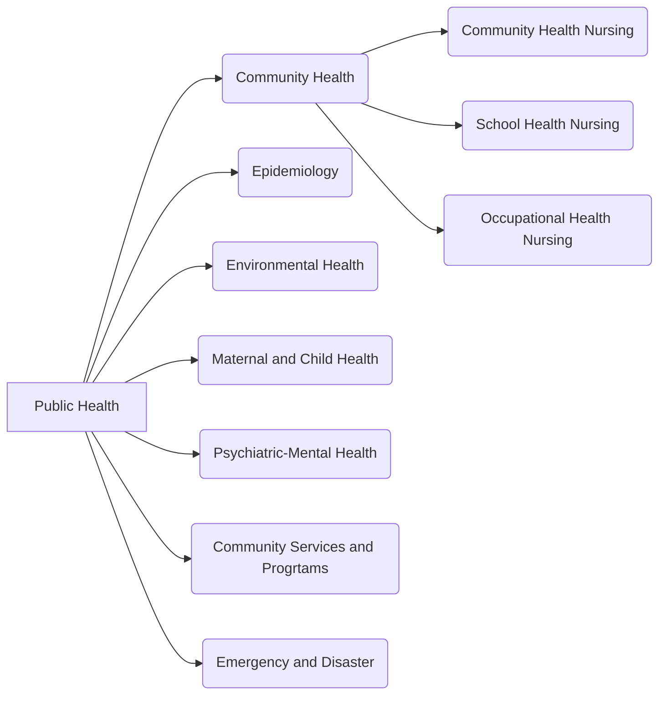

**References**:
1. Lecturer (MBSMF)

___

___

# Definitions of Public Health Nursing

| **Authority/Author**                  | **Verbatim Definition**                                                                                                                                                                                | **Key Words**                               |
| ------------------------------------- | ------------------------------------------------------------------------------------------------------------------------------------------------------------------------------------------------------ | ------------------------------------------- |
| **World Health Organization (WHO)**   | Public health nursing is the practice of promoting and protecting the health of populations using knowledge from nursing, social, and public health sciences.                                          | Sociology                                   |
| **American Nurses Association (ANA)** | Combination/synthesis of the public health practice and nursing practice towards preservation of health of the population                                                                              | Public health practice and nursing practice |
| **Margaret Jacobson**                 | Achievement of optimum level of functioning through teaching and delivery of care                                                                                                                      | Optimum level of functioning                |
| **John J. Hanlon**                    | Attainment of highest level of physical, mental, and social well-being ("*total development*)                                                                                                          | Total, Holistic                             |
| **William "Bill" Purdom**             | Survival of the human species                                                                                                                                                                          | Survival                                    |
| **Ruth B. Freeman**                   | A nursing service rendered by the professional nurse to the four levels of clientele in different health settings                                                                                      | Levels of clientele                         |
| **Salvacion G. Bailon‑Reyes**         | Community health nursing is a field of nursing practice where services are delivered outside of purely curative institutions (i.e. hospitals)                                                          | Outside of purely curative institution      |
| **Araceli Maglaya**                   | Community health nursing is the utilization of the nursing process to benefit the individual, the family and the community                                                                             | Nursing process                             |
| **C.E. Winslow**                      | A science and the art to promote health, prevent disease, and prolong life. Prolonging life is the goal of PHN, emphasizing the importance of recognizing the birthright and longevity of individuals. | Birthright and longevity                    |

These definitions talk of concepts in public health nursing including the [[#Ecosystem Influences Optimum Level of Functioning|optimum level of functioning]], [[01-levels-of-clientele|four levels of clientele]], settings of public health ([[08-clinical-visit]], [[07-home-visit]]) and [[12-apie|the nursing process applied to the family and community]].

___

# Ecosystem Influences Optimum Level of Functioning
There are six components of the ecosystem that affect an individual's optimum level of functioning:
1. **Political Factors**: safety, oppression, people empowerment
2. **Behavioral Factors**: culture, habits, morals, ethnic customs. Lifestyle-related factors that affect health, e.g., alcohol and smoking.
3. **Heredity Factors**: genetic endowment of defects, strengths, risk; familial, ethnic, racial.
4. **Health Care Delivery System**: promotive, preventive, curative, rehabilitative.
5. **Environmental Factors**: air, food, water waste, urban/rural, noise, radiation, pollution
6. **Socio-Economic Factors**: employment, education, housing

## The Community Health Nurse%%
(mn. *RT-PCR-MO-Nurse*)%%
- An **educator** as the primary medium for health promotion.
- A **generalist**, providing a wide range of services, functions, and roles.
- A **role-model**
- A **trainer** for Barangay Health Workers (BHWs) in basic health skills such as taking vital signs.
- A **planner** for implementing health programs.
- A **coordinator of services**
- Responsible for **reporting and recording**. In the Philippines, the official reporting and recording system in place is the *Field Health Service Information System* (FHSIS).
- A **manager** for the healthcare team of RNs and RMs
- An **organizer**, particularly for the Community Organizing/Participatory Action Research (COPAR).
- A **nurse care provider**.

___

# Ottawa Charter
**Ottawa Charter for Health Promotion** is a meeting held by the WHO in Ottawa, Canada, held last Nov. 17-21, 1986. The result of this meeting were the **five action areas for health promotion**%% (mn. *DR. BSC*)%%:
1. **Developing personal skills** and knowledge to make healthy choices.
2. **Reorienting health services** towards prevention and health promotion.
3. **Building healthy public policy** that support health and make healthy choices easier.
4. **Strengthening community action**—empowering communities to take ownership of their health.
5. **Creating supportive environments** that promote health and well-being.

___

# Emerging Specializations of Public Health Nursing
1. **Home Health Care**: nursing care within the home, such as chronic individuals, the elderly, convalescing individuals, and other high-risk populations.
2. **Hospice Care**: nursing care provided for terminally ill patients. Care provided is palliative and focuses on the provision of comfort, improve the quality of life, and support systems
3. **Faith Community Nursing**, also known as *parish nursing*, combines nursing care and spiritual care. The focus is limited to promotion and preservation.
4. **Forensic Nursing** applies nursing to criminal cases. For nurses who practice within prisons, their profession is called "*correctional nursing*".

___

# Related Laws
1. **Local Government Code**: R.A. 7160 decentralized and devolved healthcare by forming local government units, which shifted the focus of healthcare provision to the local government units to allow for more efficient healthcare provision. This was signed by President Corazon Aquino.
	- Look-alike: **Anti-Child Abuse Law** (R.A. 7610)
2. **Magna Carta for Public Health Workers**: R.A. 7365
3. **Occupational Safety and Health Standards Act of the Philippines**: R.A. 11058 outlines standards required for workplace safety. Clauses affecting nursing practice include:
	- A nurse is necessary for workplaces which employ 100 or more workers.
	- For a workplace to not need a nurse, a nearby clinic or facility should be located within 1 kilometer, or if there are less than 100 workers.
	- In clinics and facilities, there should be a ratio of 1 bed per 100 workers.
4. **Philippine Labor Code**: P.D. 442
	- This act describes the healthcare members required based on the number of workers:
		- 100+ workers: 1 full-time nurse
		- 200+ workers: 1 full-time nurse, 1 part-time doctor, and 1 part-time dentist
		- 300+ workers: 1 full-time nurse, 1 full-time doctor, and 1 full-time dentist
		- By the law, 1 to 2 hours of daily shifts constitute "part-time", while a "full-time" shift is at least 8 hours per day.
	- Night Shift Differential: a clause that mandates an increase of night shift workers (2200 to 0600) are given an additional 10% bonus.
5. **Universal Health Care Act** (R.A. 11223)
	- Look-alike: Mandatory Reporting of Notifiable Diseases (R.A. 11332)
6. **Malasakit Center Law** (R.A. 11463)
7. **Mandatory Reporting of Notifiable Diseases** (R.A. 11332)
	- Look-alike: Universal Health Care Act (R.A. 11223)
8. **Food Fortification Act** (R.A. 8976) aims to fortify commonly eaten foods such as junk foods and other foods with essential nutrients (marked by the *Sangkap Pinoy* Seal) to reduce rates of deficiency.
9. **Kalusugan at Nutrisyon ng Magnanay Act** (R.A. 11148), also known as the *First 1000 Days Law*, outlines the nutritional guidelines of a child's first 1000 days, starting from pregnancy up to 2 years of age.
10. **Nutrition Act of the Philippines** (P.D. 491)
