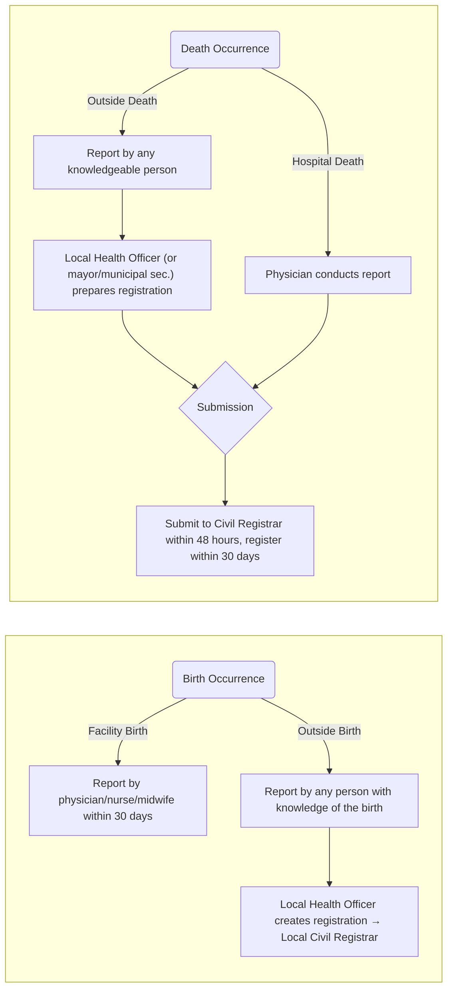

**References**:
1. Lecturer (MBSMF)

___

# Census

The **census** is the official enumeration of the total population. The latest report on the population of the Philippines is **116.8 million**. When this data is used to *describe* the population, whether by education, language, or religion, this is called **demography**.
- There are two **methods of census**: *De jure*: description of the population based on the place of registration. *De facto*: description of the population based on their current location.
- The **place of registration** is based on *Just Soli* (based on land) or *Just Sanguini* (based on lineage).
- The entity responsible for conducting the census is the Philippine Statistics Authority (PSA) based on R.A. 10625 signed by Pinoy, which converted the previously named National Statistics Office (NSO) based on R.A. 3753.

___

# Registration
Individual records include birth records, death records, marriage and divorce records, and records on adoption, legitimation, and recognition, among others.
1. **Birth record** is a legal document establishing name, parentage, birth date, order of birth, legitimacy, citizenship, nationality, geographic place of birth. Many individual rights and entitlements are dependent on the birth record, such as entry to school, driver's license, passport issuance, tax/insurance benefits, etc.
	- The law outlining the procedure for registering births is discussed in [[#Related Laws]].
2. **Death record** is a documentary proof surrounding the death of the person such as time and place of death as well as medical cause of death. Proof of death and the associated facts are usually used for property inheritance rights and right to remarry of surviving spouse.
	- The law outlining the procedure for registering deaths is discussed in [[#Related Laws]].
3. **Marriage and divorce records** are usually needed for social and economic programs, tax privileges for couples, alimony, change of nationality, and right to remarry.
4. **Records on adoption, legitimation and recognition** are used for determining rights of individuals (children, parents, guardians), which may vary from one country to another.

___

# Related Laws
1. **P.D. 651**, older version: birth registration must be completed within 60 days.
2. **P.D. 766**, the more recent law on registration, amends two sections from P.D. 651: section 2, which discusses birth registrations, and section 5, which discusses death registrations.
	- Section 2: Birth registration must be done within 30 days, and is free of charge. Births are either facility-based or non-facility-based. Facilities may be hospital-based or lying-in.
		- For **facilities**, reports are handled by the physician, nurse, or midwife.
		- In **outside births**, a *report* can be made by anyone who has knowledge of the birth, e.g., the husband, for which the birth *registration* will be created by the local health officer. Registrations are done at the local civil registrar.
	- Section 5: Death registration must be done within 30 days, and is free of charge. Deaths are either hospital-based or non-hospital based.
		- **Deaths occurring in a hospital** is reported by the last attending physician who attended to the patient or who pronounced the individual as dead.
		- **If the death occurred outside**, anyone who has knowledge of the death may report the death, for which the death registry will be created by the local health officer, or else the mayor, or else the municipal secretary. Both reports from the physicians or witness must be reported to the local civil registrar within 48 hours.
		- Death *reports* are registered *where the death occurred*. Deaths should be *registered* at the *same location of their registration*.

| Aspect                          | **P.D. 651** (Jan 31, 1975)                                                                                      | **P.D. 766** (Aug 20, 1975)                                                                                                                                     |
| ------------------------------- | ---------------------------------------------------------------------------------------------------------------- | --------------------------------------------------------------------------------------------------------------------------------------------------------------- |
| **Purpose**                     | Required registration of births and deaths from Jan 1, 1974 onwards                                              | Amended Sections 2 and 5 of P.D. 651 to streamline reporting and registration timelines                                                                         |
| **Birth Registration Deadline** | **60 days** from date of birth                                                                                   | **30 days** from date of birth                                                                                                                                  |
| **Birth Reporting Authority**   | Physician, nurse, midwife, *hilot*, parent, relative, or any person with knowledge                               | **Facility births**: reported by physician/nurse/midwife; **non-facility births**: anyone may report                                                            |
| **Where to Register Birth**     | Local Civil Registrar of the place where the birth occurred                                                      | Same as P.D. 651                                                                                                                                                |
| **Death Registration Deadline** | **60 days** from date of death                                                                                   | **30 days** from date of death                                                                                                                                  |
| **Late Death Reporting Rule**   | After 60 days, report must be filed within **48 hours of gaining knowledge**, then registered within **30 days** | All **deaths** (hospital or otherwise) must be **reported within 48 hours** of occurrence, then registered within **30 days**                                   |
| **Death Reporting Authority**   | Attending physician or anyone with knowledge (e.g., relative)                                                    | **Hospital deaths**: last attending physician reports; **non-hospital deaths**: any informed person may report → Local Health Officer, mayor, or municipal sec. |
| **Where to Register Death**     | Local Civil Registrar of the place where the death occurred                                                      | Same as P.D. 651                                                                                                                                                |

3. **P.D. 856**: the Sanitation Code of the Philippines states that a death certificate required prior to burial. This is because a death registration determines the cause of death. Individuals with highly infectious diseases are not permitted a burial, but rather a cremation.

The collection of vital statistics is included in the **civil registry system**. Vital statistics is important as a legal document for the person named as well as a document to describe the demographics and health of populations. The most important individual records include birth, death, marriage/divorce. They are also used for program planning, such as in maternal and child health services, child immunization programs, epidemic or outbreak investigations and assessment of causes of accidents and injuries.
