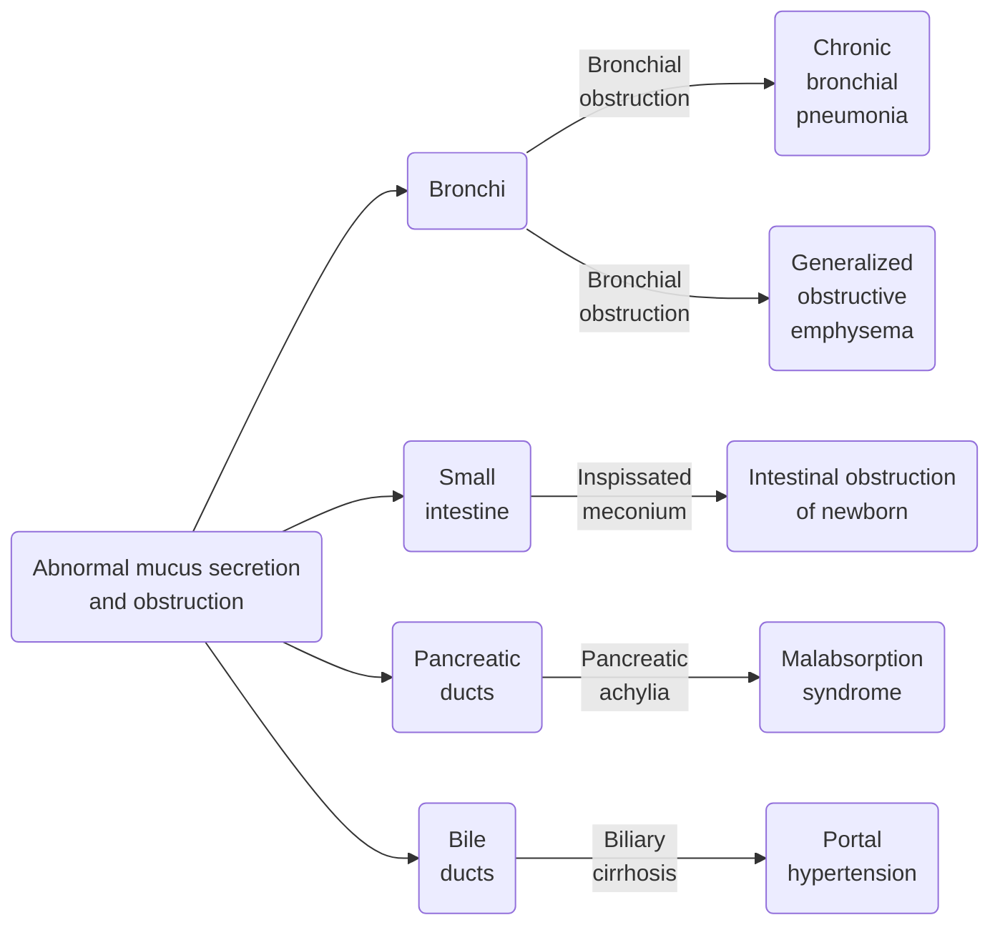

**References**:
- Wong's Nursing Care of the Infant and Child (Ch. 28, pp. 1233-1244)
- Brunner-Suddarth's Medical-Surgical Nursing (Ch. 24, pp. 665-667)

**Cystic fibrosis** (CF) is a condition characterized by exocrine (mucus-producing) gland dysfunction that produces multisystem involvement. Abnormal transport of sodium and chloride across epithelium leads to increased viscosity of airway mucus, abnormal mucociliary clearance, and lung disease.

CF is the most common fatal **autosomal recessive disease** among Caucasians. It is less frequently found among Hispanic-Americans, Asian-Americans, and African-Americans. A defective copy of the CF gene must be inherited from both parents to have CF.
- Diagnosis is usually made by 2 years of age, but may not occur until later in life. Respiratory symptoms are frequently the major manifestation of CF when it is diagnosed later in life. However, many patients will not demonstrate the classic symptoms of CF, which may potentially cause a diagnostic dilemma.
- More than 95% of documented cases occur in Caucasians.

>[!ERROR] Pathophysiology
>CF is caused by mutations or dysfunction in the protein cystic fibrosis transmembrane conductance regulator (CFTR), which normally transports chloride ions across epithelial cell membranes. The CFTR gene is found on the long arm of chromosome 7.
>
>The dysfunction of ion transport result in CF, which is characterized by thick, viscous secretions in the lungs, pancreas, liver, intestine, and reproductive tract as well as increased salt content in sweat gland secretions. The primary factor responsible for many clinical manifestations of the disease is **mechanical obstruction** caused by the increased viscosity of mucous gland secretions. Small passages in organs such as the pancreas and bronchioles become obstructed as secretions precipitate or coagulate to form concretions in glands and ducts.
>- Over 1,800 mutations have been identified to cause CF, the most common being ΔF508 (~70% of patients). The ability to detect these mutations allows for routine screening for CF and detection of carriers of the disease. **Genetic counseling** is important for couples at risk.
>- Because the mutation is recessive, patients who are heterozygous for CF (i.e., have one defective gene and one normal gene) will not display the disease.

___
# Clinical Manifestations
The clinical manifestations vary widely and change as the disease progresses. The most common symptoms are (1) progressive chronic obstructive lung disease associated with infection; (2) maldigestion from exocrine pancreatic insufficiency; (3) growth failure from malabsorption and anorexia; and (4) diabetes symptoms of hyperglycemia, polyuria, glycosuria, and weight loss from pancreatic insufficiency. The usual pattern is failure to thrive and weight loss despite an increased appetite and gradual deterioration of the respiratory system.
1. **Respiratory Tract**: initial pulmonary manifestations appear as wheezing respirations and a dry, nonproductive cough. Eventually diffuse bronchial and bronchiolar obstruction leads to irregular aeration with progressive pulmonary disturbance and secondary infection. 
	- The most prominent and constant feature of pulmonary involvement is a **chronic cough**. Dyspnea increases, the cough often becomes paroxysmal, and the mucoid impactions within the small air passages causes a generalized obstructive hyperinflation and patchy areas of atelectasis.
	- An **overinflated, barrel-shaped chest** can occur from air trapping
	- Trapped air can form bronchiectatic cysts and subpleural blebs in the upper lobes in advanced disease and may rupture, causing **pneumothorax**.
	- With significant impairment of gas exchange, **cyanosis** and **clubbing** of the fingers and toes may occur.
	- Upper respiratory manifestations of the disease include **sinusitis** and **nasal polyps** that result from accumulation of secretions and inflammatory products.
	- Colonization of the airways with pathogenic bacterial usually occurs early in life. *S. aureus* and *H. influenzae* are common organisms during early childhood. As the disease progresses, *P. aeruginosa* is ultimately isolated from the sputum of most clients.
2. **Gastrointestinal Tract**: the earliest postnatal manifestation of CF is **meconium ileus**, which occurs in 15% to 20% of newborns with the disease. Thick, putty-like, tenacious, mucilanginous meconium blocks the lumen of the small intestine, usually at or near the ileocecal valve, which gives rise to signs of **intestinal obstruction**, including abdominal distention, vomiting, failure to pass stools, and rapid development of dehydration with associated electrolyte imbalance. Thick intestinal secretions continue to be problematic throughout life. Children of all ages are subject to intestinal obstruction (distal ileum) from **heavy or impacted feces**.
	- As disease progresses, obstruction of pancreatic ducts prevents digestive enzymes (e.g., trypsin, chymotrypsin, amylase, lipase) from being released into the duodenum, which prevents conversion of ingested food into compounds that can be absorbed by the intestinal mucosa. Consequently, the undigested food (chiefly unabsorbed fats and proteins) is excreted, increasing the bulk of the feces to two or three times the normal amount. This abnormal size may initially be unnoticed, but by 6 months **large, loose stools with normal frequency or  has chronic diarrhea with unformed stools**. As solid foods are added to the diet, the **excessively large stools become frothy and extremely foul smelling**.
	- **Growth failure** occurs due to malabsorption. Wasting and avitaminosis may occur.
	- **Protein deficiency** may result in hypoalbuminemia and generalized edema.
	- **Avitaminosis**, particularly of the fat-soluble vitamins A, D, E, and K can cause problems such as bleeding (Vitamin K) and anemia.
3. **Reproductive System**: delayed puberty in girls with CF is common even when their nutritional and clinical status is good. Women with CF who become pregnancy have an increased incidence of premature labor and delivery and low birth weight in the infant. Favorable nutritional status and pulmonary function are positively correlated with favorable pregnancy outcomes. **Infertility** becomes an issue due to obstruction of gametes. 
4. **Integumentary System**: the consistent finding of abnormally high sodium and chloride concentrations in the sweat is a unique characteristic of CF as the chloride channel defect prevents reabsorption of sodium and chloride in the sweat glands. Parents may observe that their infants are "salty" when they kiss them. This can be a cause of abnormal sodium and chloride loss, dehydration, and hypochloremic and hyponatremic alkalosis.
___
# Diagnostic Evaluation
Traditionally, a diagnosis is made on (a) a **positive sweat chloride test**, (b) **absence of pancreatic enzymes** (endoscopic duodenal aspiration), (c) **radiography**, (d) **chronic obstructive pulmonary disease**, and (e) family history.
- **Sweat Chloride Test** (pilocarpine iontophoresis): a quantitative assessment of sweat electrolytes. Sweating is induced with a special device and at least 75 mg of sweat is collected on filter paper. Two separate samples are collected to ensure reliability. Normal sweat chloride content is less than 40 mEq/L, with a mean of 18 mEq/L. A chloride concentration greater than 60 mEq/L is highly suggestive of CF.
- **Chest radiography** reveals characteristic patchy atelectasis and obstructive emphysema. PFTs are sensitive indices of lung function, providing evidence of abnormal small airway function in CF. Radiographs, including contrast enema, are used for diagnosis of meconium ileus.

Newer diagnostic methods, in addition to the aforementioned, make it possible to diagnose CF early in infancy: newborn screening, deoxyribonucleic acid (DNA) identification of mutant genes, or abnormal nasal potential difference measurement.
- **Screening** consists of an immunoreactive trypsinogen analysis of dried blood, which may be followed by direct analysis of DNA for the presence of the ΔF508 mutation or other mutations on the same dried blood spot.
- **DNA testing** may substitute a sweat test. The detection of known mutations can predict the presence of CF with high certainty.
___
# Therapeutic Management
CF requires both acute and chronic therapy. Improvements in antibiotic therapy and improved nutritional and respiratory management have extended CF median survival age of a child born in 2019 to be 48 years.
1. **Airway clearance therapy** is a key intervention, and various pulmonary techniques are used to enhance secretion clearance. Parents should be taught how to perform ACTs at home, which is an important contributor to the success of therapy.
	- **Manual postural drainage** and **chest physiotherapy**; high-frequency chest wall oscillation; autogenic drainage (a combination of breathing techniques at different lung volume levels to move the secretions to where they can be huff-coughed out); and other devices that assist in airway clearance, such as masks that generate positive expiratory pressure (PEP masks) and "flutter devices" (devices that provide an oscillatory expiratory pressure pattern with PEP and assist with expectoration of secretions.)
		- Coughing, turning, and deep breathing exercises may also help.
		- If ineffective, suctioning may also be done as needed.
	- **Mucolytics**/**Expectorants**: Dornase alfa is a nebulized medication given to decrease the large amount of deoxyribonucleic acid (DNA) that accumulates within CF mucus. This decreases viscosity and promotes expectoration of secretions.
	- Inhalation of hypertonic saline may also be used for chronic treatment of CF. This hydrates the airways and improves airway clearance.
	- **Bronchodilators** are used for patients with a bronchoconstrictive element in their condition, as confirmed by incentive spirometry before and after therapy is instituted.
	- **Exercise** is an important adjunct to airway clearance therapy. The ultimate goal is to increase lung vital capacity, remove secretions, increase pulmonary blood flow, and maintain healthy lung tissue for effective ventilation. Any aerobic exercise preferred by the client should be encouraged. Exercise also provides a sense of well-being.
	- **Increased hydration** can help reduce secretions tenacity.
2. **Antibiotics** based on sputum cultures are implemented for acute airway exacerbations. While majority of patients are colonized with *P. aeruginosa*, *S. aureus*, *methicillin-resistant S. aureus*, and *Burkholderia cepacia complex* may be found. Routine cultures are used to identify organisms and guide antibiotic selection.
	- Chronic colonization with *P. aeruginosa* is an independent risk factor for accelerated loss of lung function and decreased survival.
	- Treatment is continued until exacerbations have resolved, usually at a minimum of 10 days to as long as 3 weeks or more.
	- Nebulization can be used for chronic colonization, promoting high intrapulmonary drug concentrations and minimal systemic absorption of the antibiotics.
	- Complete pneumonia and flu vaccines.
3. **Oxygen therapy** may be required in advancing pulmonary deterioration. Double-lung transplantation may also be done for a small, selected population of patients with CF.
4. **Pancreatic Supplementation**: nearly 90% of patients with CF have pancreatic exocrine insufficiency and require **oral enteric-coated pancreatic enzyme supplementation** with meals.
	- Given the fat malabsorption in CF and increased caloric needs due to the work of breathing, nutritional counseling and weight monitoring are extremely important. **Supplements of fat-soluble vitamins** (A, D, E, and K) are also used.
	- Fat is not restricted in the diet
5. **CFTR Modulators** are a new (2016) class of drugs attempting to improve the function of defective CFTR proteins, used for G551D and ΔF508 mutations. These are extremely costly and only viable for those with specific types of mutations.
___
# Nursing Management
Assessment of the child with CF involves comprehensive assessment and history of all affected systems with special focus on pulmonary (lung sounds, cough, evidence of fatigue) and gastrointestinal systems (bowel patterns). Failure to thrive should also be assessed.
1. **Promote the removal of pulmonary secretions**: chest physiotherapy, breathing exercises.
2. **Reduction of risk factors**, especially through health education, e.g., exposure to crowds or to people with known infections.
3. **Monitor for early signs and symptoms of respiratory infection and disease progression**. Educate the client about symptoms they may experience and when to notify a primary provider.