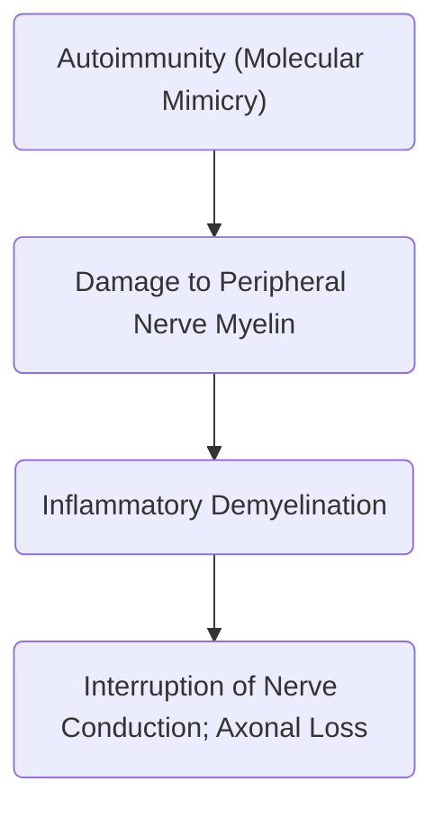

**GBS** is an autoimmune attack on the **peripheral nerve myelin**, resulting in acute, rapid segmental demyelination of peripheral nerves and some cranial nerves, producing ==symmetrical ascending weakness== (classical) with dyskinesia, hyporeflexia, and paresthesias.
- **An antecedent event**, most commonly from viral infection, result in the clinical presentation of 60% to 70% of GBS cases. *Campylobacter jejuni* is implicated in 40% of cases.
- Men and women are equally affected. GBS may appear at any age, but is more common between 30 and 50 years of age.
- Prognosis: 70% recovery, 30% disability, 5%-10% mortality

___
# Clinical Manifestations
Demyelination often occurs 1 to 3 weeks before symptoms begin.
1. **Muscle Weakness**, **Diminished Reflexes** of the **Lower Extremities**, which may progress to **Tetraplegia**. This may ascend upwards and plateau (at varying lengths) at respiratory failure. Peak severity takes from 2 weeks to no longer than 4 weeks. If the progress lengthens past 4 weeks, the patient is classified as having **chronic inflammatory demyelinating polyneuropathy**.
	- **Neuromuscular Respiratory Failure** and **Bulbar Weakness** may result from damage to the myelin sheath for nerves that innervate the diaphragm and intercostal muscles.
2. **Sensory Impairment**: **paresthesias**, **pain related to demyelination of sensory fibers**
3. **Cranial Nerve Demyelination**:
	- Cranial Nerve II (**Optic**): blindness
	- Cranial Nerve IX, X (**Glossopharyngeal**, Vagus): swallowing and clearing secretions is impaired.
	- Cranial Nerve X (**Vagus**): instability of the cardiovascular system; tachycardia, bradycardia, hypertension, orthostatic hypotension.
___
# Diagnostic Examination
Diagnosis of GBS is mainly symptomatic.
1. **Symmetric weakness**, **diminished reflexes**, and history of **upward progression of muscle weakness**.
2. **History of viral illness** in the previous weeks (1 to 3).
3. Changes in **vital capacity** and **negative inspiratory force** is during impending neuromuscular respiratory failure.
4. **CSF Evaluation** shows elevated proteins as a result of myelin destruction.
5. **Electrophysiology** shows progressive loss of nerve conduction velocity.
___
# Medical Management
**ICU care** is required due to rapid progression and risk for neuromuscular respiratory failure. Baseline values are identified and changes in muscle strength and respiratory function can alert the clinician to the needs of the patient.
- **Therapeutic Plasma Exchange** (Plasmapheresis) and **IVIG** help reduce peripheral nerve myelin antibody levels, reducing the amount of time the patient remains immobilized and dependent on MV.
- **Respiratory therapy** or **mechanical ventilation** may be necessary for supporting pulmonary function and oxygenation. These may be weaned off when spontaneous respiration becomes effective. **Elective intubation** may be done prior to extreme respiratory muscle fatigue, as emergent intubation can result in autonomic dysfunction.
- **Preventing immobility complications**: the use of **anticoagulants** or **sequential compression boots** avoid DVTs, VTEs, and PEs.
- **Cardiovascular risks**: **ECG** monitoring is required because of autonomic dysfunction. The nurse should be ready to treat for tachycardia, bradycardia, hypertension, or hypotension. Autonomic dysfunction is labile, making short-acting management beneficial.
___
# Nursing Care Management
**On-going assessment for disease progression is critical**. Life-threatening conditions such as respiratory failure, cardiac arrhythmias, and VTE/DVT/PEs are checked so intervention may be initiated.
1. **Maintaining Respiratory Function**: **incentive spirometry** and **CPT**; monitor changes in vital capacity and negative inspiratory force. Prepare for MV if vital capacity falls.
2. **Enhancing Physical Mobility**: prevention of the complications of immobility—ROM, positioning/repositioning, hydration, padding. Maintain safety.
3. **Providing Adequate Nutrition**: a paralytic ileus may result from inadequate parasympathetic activity. IV fluids and parenteral nutrition may be used until bowel sounds return. **Bulbar paralysis** may result in an inability to swallow, requiring a **gastrotomy tube** to be put in place. **Oral nutrition** is continued once the gag reflex and bowel sounds are back to normal.
4. **Improving Communication**: cognition remains complete intact, but the patient is unable to speak, laugh, or cry. An **alternative method for communication** needs to be established e.g. the use of picture cards or blinking. Collaboration with a speech therapist may be helpful.
5. **Reducing Fatigue**: pacing activities, scheduling periods of physical and mental rest.