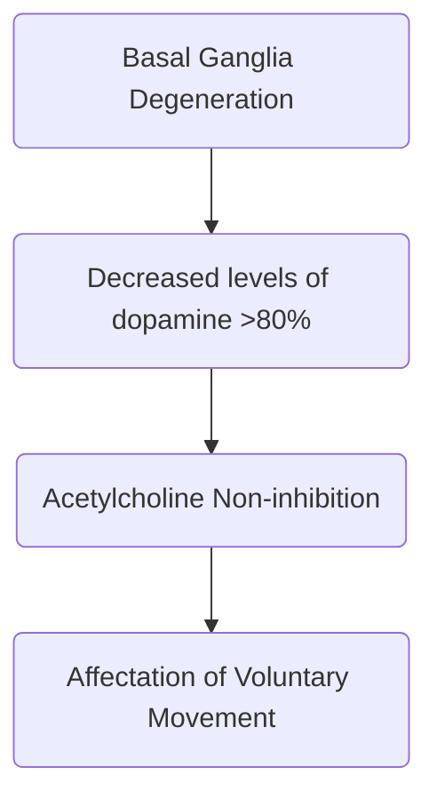

**PD** is a slowly progressing neurologic movement disorder that eventually leads to disability. It affects men more than women, usually appearing in the fifth decade of life. PD may be idiopathic or degenerative (primary), but can also take a secondary form with a known or suspected cause. Most cases have unknown etiologies, but are suggested to stem from a multifactorial combination of age, environment, and heredity.

___
# Clinical Manifestations
PD features a gradual onset, progressing slowly over a chronic, prolonged course. Its **cardinal signs** are (mn. TRAP) ==**tremors, rigidity, bradykinesia/akinesia, and postural instability**==.
1. **Tremor**: a **slow, unilateral resting (non-intention) tremor** is present in the majority of patients at the time of diagnosis.
2. **Rigidity**: **resistance to passive limb movement** characterizes muscle rigidity. Passive movement may also result in jerky increments, referred to as **lead-pipe** or **cog-wheel movements**.
3. **Bradykinesia**: overall **slowing of active movement**. Activities take longer to finish, and initiation of movement (rising from sitting position, turning in bed) is difficult.
4. **Postural Instability**: propulsive gait (forward-leaning posture), shuffling gait (feet barely lift off the ground).
5. **Autonomic symptoms** that include excessive and uncontrolled sweating, drooling, paroxysmal flushing, orthostatic hypotension, gastric and urinary retention, constipation, and sexual dysfunction.
	- **Dysphagia** is a substantial problem, with more than 50% of patients reporting choking as well as vision and olfactory changes.
	- **Neurogenic Orthostatic Hypotension** is found in 30% to 50% of patients.
6. **Psychiatric symptoms** include depression, anxiety, dementia, delirium, hallucinations (auditory, visual), and psychosis.
	- **Depression** and **anxiety** are common (not certain if as a biophysical manifestation or as a reaction to the disorder).
	- **Stress**, **medications**, and **depression** contribute to the cognitive changes of diminished executive functions, attention difficulties, decreased thinking, and word-finding challenges.
	- 80% of patients with a 20 year history of PD have dementia; a general decline in higher brain functioning.
7. Further loss of dexterity results in **micrographia** (small handwriting) and a **masklike, expressionless face**. **Dysphonia** may occur as a result of weakness and incoordination of the muscles responsible for speech. This also often results in **dysphagia** and drooling; risks for choking and aspiration.
8. **Complications** are often as a result of disordered movement: respiratory and urinary infection, skin breakdown, and fall injuries. Treatment may also have adverse results of **dyskinesia** or **orthostatic hypotension**.
___
# Diagnostic Examination
The disease is currently diagnosed through **patient history** and the presence of at least two of the four cardinal manifestations—tremors, bradykinesia, rigidity, postural changes.
___
# Management
1. **Medical**: symptomatic and maintenance of functional independence. No current medical approaches can prevent disease progression. Care is individualized based on symptoms and other needs.
2. **Pharmacologic**: the mainstay of treatment. **Antiparkinsonian medications** increase striated dopaminergic activity, counteracting the neurotransmitter imbalance. Benefits of treatment wane over time, being most pronounced in the first year or two of treatment.
	- **Levodopa** is the most effective agent. It is converted to dopamine in the basal ganglia, producing symptom relief.
	- **Carbidopa** is often added to Levodopa to prevent it from being metabolized before reaching the brain.

>[!WARNING] Tardive Dyskinesia
>**Responses to Levodopa in most patients become dyskinetic after 5 to 10 years**: facial grimacing, rhythmic jerking movements of the hands, head bobbing, chewing and smacking movements, and involuntary movements of the trunk and extremities. An "on-off" syndrome, switching from effective treatment (on) to periods of near immobility (off) may occur as response to levodopa treatment.
>
>Nausea, vomiting, anorexia, decrease in BP, dystonia, dyskinesia, and confusion are other adverse effects. To minimize adverse effects, delaying the use of levodopa treatment as long as possible is done in current practice, using other drugs for symptomatic control.

3. **Surgical** approaches may be considered for disabling tremors, rigidity, or severe levodopa-induced dyskinesia. Surgical procedures often only occur 10 to 13 years after diagnosis. Stereotactic procedures for permanent brain tissue destruction (thalamotomy, pallidotomy) were previously used to relieve tremors and other symptoms. Ablative tissues are no longer used, and have been replaced by **deep-brain stimulation** (DBS).
	- **Deep-Brain Stimulation**: an electrode is surgically inserted into the brain in the globus pallidus or subthalamic nucleus (bilaterally). A small shock is used to test if electrode placement is correct. If successful, this acts to **increase dopamine secretion or block anticholinergic secretion**, improving tremor and rigidity. Eligible only for patients who experience dyskinesia in response to levodopa, have a 5-year history of PD, or have disabling tremors.
	- **Experimental Neural Transplantation** is being studied in an attempt to replace degenerated striatal cells.
___
# Nursing Care Management
1. **Improve Mobility**: improve functional mobility and maintain independence in ADLs
	- **Progressive daily exercise** improves strength, coordination, dexterity; and reduces rigidity and prevents contractures. **Joint mobility and ROM** are important aspects of exercise. **Postural exercises** are also useful for preventing postural changes.
	- **Warm baths and massage** relaxes muscles and relieves muscle spasm and rigidity.
	- **Gait Retraining**: techniques to improve gait when walking. Commonly, the patient can visualize stepping over imaginary lines as a visual cue to enhance gait (*line stepping*).
2. **Enhancing Self-Care Activities**: encouraging, educating, and supporting the patient during ADLs promote self-care. Environmental modifications, adaptive or assistive devices e.g. an overhead trapeze for getting up out of bed, and consultation with an occupational therapist also help.
	- **Improving Bowel Elimination**: a regular bowel routine and schedule, increasing fluid intake, and moderate fiber content in diets can help. Elevated toilet seats can help due to difficulties in moving from a standing to a sitting position. Laxatives are not suggested.
	- **Improving Nutrition**: **Risks for choking and aspiration** are present due to impaired swallowing and accumulation of saliva. Aspiration may not be felt. **Aspiration pneumonia** may occur. Weekly weight monitoring indicate whether caloric intake is adequate. An **NGT or PEG tube** may be used as the disease progresses. A **dietitian consultation** may be required.
	- **Enhancing Swallowing**: patients should be **put in an upright position during mealtime** to reduce aspiration risk resulting from swallowing difficulties and choking. A **semisolid diet** with **thick liquids** is easier to swallow than solids. **Thin liquids should be avoided**. It is encouraged for the patient to consciously and voluntarily perform the swallowing sequence. Consciously swallowing can also prevent saliva buildup.
	- **Encouraging the Use of Assistive Devices**: electric warming tray for prolonged eating time, special utensils, stabilized plates, and non-spill cups.
3. **Improving Communication**: speech disorders are present in most cases. **Low-pitched, monotonous, soft-speech of patients** require them to put conscious effort and attention into speaking. Facing the listener, exaggerating pronunciation, and using short sentences all help. A few deep breaths before speaking maintains breath during speech. Consultation with a **speech therapist** may be helpful. A **small electronic amplifier** can be used for low speech volume.
4. **Supporting Coping Abilities**: encourage the patient and point out that activities are maintained through active participation. Patients become withdrawn, embarrassed, apathetic, inadequate, bored, and lonely. A positive self-concept is important. Allow the patient to set achievable goals and perform independently as much as possible.